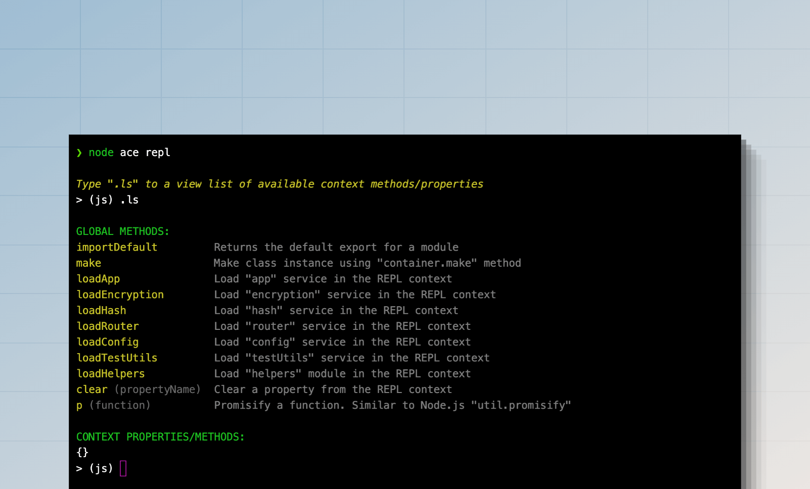

# REPL
Like the [Node.js REPL](https://nodejs.org/api/repl.html), AdonisJS offers an application-aware REPL to interact with your application from the command line. You can start the REPL session using the `node ace repl` command.

```sh
node ace repl
```



On top of a standard Node.js REPL, AdonisJS provides the following features.

- Import and execute TypeScript files.
- Shorthand methods to import container services like the `router`, `helpers`, `hash` service, and so on.
- Shorthand method to make class instances using the [IoC container](../concepts/dependency_injection.md#constructing-a-tree-of-dependencies).
- Extensible API to add custom methods and REPL commands.

## Interacting with REPL
Once you start the REPL session, you will see an interactive prompt in which you can write valid JavaScript code and press enter to execute it. The output of the code will be printed on the following line.

If you want to type multiple lines of code, you can enter into the editor mode by typing the `.editor` command. Press `Ctrl+D` to execute a multiline statement or `Ctrl+C` to cancel and exit the editor mode.

```sh
> (js) .editor
# // Entering editor mode (Ctrl+D to finish, Ctrl+C to cancel)
```

### Accessing the result of the last executed command
If you forget to assign the value of a statement to a variable, you can access it using the `_` variable. For example:

```sh
> (js) helpers.string.generateRandom(32)
# 'Z3y8QQ4HFpYSc39O2UiazwPeKYdydZ6M'
> (js) _
# 'Z3y8QQ4HFpYSc39O2UiazwPeKYdydZ6M'
> (js) _.length
# 32
> (js)
```

### Accessing error raised by last executed command
You can access the exception raised by the previous command using the `_error` variable. For example:

```sh
> (js) helpers.string.generateRandom()
> (js) _error.message
# 'The value of "size" is out of range. It must be >= 0 && <= 2147483647. Received NaN'
```

### Searching through history
The REPL history is saved in the `.adonisjs_v6_repl_history` file in the user's home directory. 

You can loop through the commands from the history by pressing the up arrow `↑` key or pressing `Ctrl+R` to search within the history.

### Exiting from REPL session
You can exit the REPL session by typing `.exit` or press the `Ctrl+C` twice. AdonisJS will perform a graceful shutdown before closing the REPL session.

Also, if you modify your codebase, you must exit and restart the REPL session for new changes to pick up.

## Importing modules
Node.js does not allow using the `import` statements inside the REPL session. Therefore, you must use the dynamic `import` function and assign the output to a variable. For example:

```ts
const { default: User } = await import('#models/user')
```

You can use the `importDefault` method to access default export without destructuring the exports.

```ts
const User = await importDefault('#models/user')
```

## Helpers methods
Helper methods are shortcut functions you can execute to perform specific actions. You can view the list of available methods using the `.ls` command.

```sh
> (js) .ls

# GLOBAL METHODS:
importDefault         Returns the default export for a module
make                  Make class instance using "container.make" method
loadApp               Load "app" service in the REPL context
loadEncryption        Load "encryption" service in the REPL context
loadHash              Load "hash" service in the REPL context
loadRouter            Load "router" service in the REPL context
loadConfig            Load "config" service in the REPL context
loadTestUtils         Load "testUtils" service in the REPL context
loadHelpers           Load "helpers" module in the REPL context
clear                 Clear a property from the REPL context
p                     Promisify a function. Similar to Node.js "util.promisify"
```

## Adding custom methods to REPL
You can add custom methods to the REPL using `repl.addMethod`. The method accepts the name as the first argument and the implementation callback as the second argument.

For demonstration, let's create a [preload file](../concepts/adonisrc_file.md#preloads) file and define a method to import all models from the `./app/models` directory.

```sh
node ace make:preload repl -e=repl
```

```ts
// title: start/repl.ts
import app from '@adonisjs/core/services/app'
import repl from '@adonisjs/core/services/repl'
import { fsImportAll } from '@adonisjs/core/helpers'

repl.addMethod('loadModels', async () => {
  const models = await fsImportAll(app.makePath('app/models'))
  repl.server!.context.models = models

  repl.notify('Imported models. You can access them using the "models" property')
  repl.server!.displayPrompt()
})
```

You can pass the following options to the `repl.addMethod` method as the third argument.

- `description`: Human-readable description to display in the help output.
- `usage`: Define the method usage code snippet. If not set, the method name will be used.

Once done, you can restart the REPL session and execute the `loadModels` method to import all the models.

```sh
node ace repl

# Type ".ls" to a view list of available context methods/properties
> (js) await loadModels()
```
