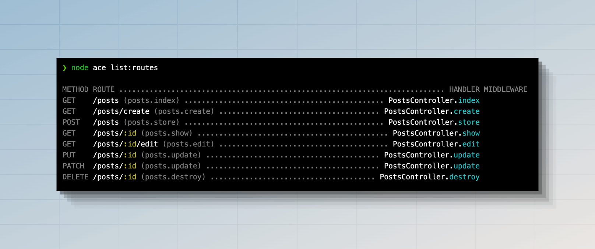
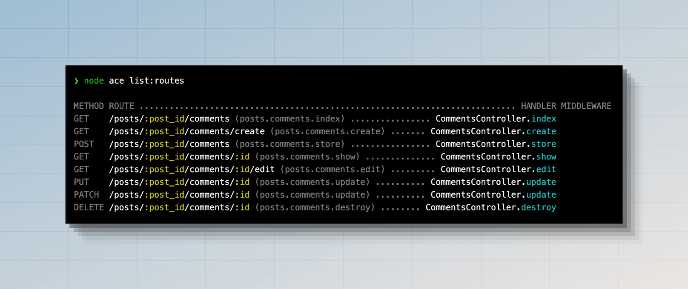
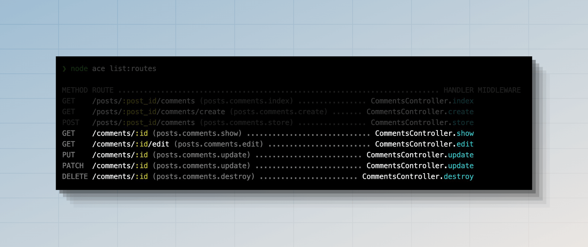

# Controllers

HTTP controllers offer an abstraction layer to organize the route handlers inside dedicated files. Instead of expressing all the request handling logic within the routes file, you move it to controller classes.

The controllers are stored within the `./app/controllers` directory, representing each controller as a plain JavaScript class. You may create a new controller by running the following command.

See also: [Make controller command](../references/commands.md#makecontroller)

```sh
node ace make:controller users
```

A newly created controller is scaffolded with the `class` declaration, and you may manually create methods inside it. For this example, let's create an `index` method and return an array of users.

```ts
// title: app/controllers/users_controller.ts  
export default class UsersController {
  index() {
    return [
      {
        id: 1,
        username: 'virk',
      },
      {
        id: 2,
        username: 'romain',
      },
    ]
  }
}
```

Finally, let's bind this controller to a route. We will import the controller using the `#controllers` alias. The aliases are defined using [subpath imports feature of Node.js](../getting_started/folder_structure.md#the-sub-path-imports).

```ts
// title: start/routes.ts
import router from '@adonisjs/core/services/router'
const UsersController = () => import('#controllers/users_controller')

router.get('users', [UsersController, 'index'])
```

As you might have noticed, we do not create an instance of the controller class and instead pass it directly to the route. Doing so allows AdonisJS to:

- Create a fresh instance of the controller for each request.
- And also construct the class using the [IoC container](../concepts/dependency_injection.md), which allows you to leverage automatic dependency injection.

You can also notice that we are lazy-loading the controller using a function.

:::warning

Lazy-loading controllers are needed when you are using [HMR](../concepts/hmr.md).

:::

As your codebase grows, you will notice it starts impacting the boot time of your application. A common reason for that is importing all controllers inside the routes file.

Since controllers handle HTTP requests, they often import other modules like models, validators, or third-party packages. As a result, your routes file becomes this central point of importing the entire codebase.

Lazy-loading is as simple as moving the import statement behind a function and using dynamic imports.

:::tip

You can use our [ESLint plugin](https://github.com/adonisjs/tooling-config/tree/main/packages/eslint-plugin) to enforce and automatically convert standard controller imports to lazy dynamic imports.

:::

### Using magic strings

Another way of lazy loading the controllers is to reference the controller and its method as a string. We call it a magic string because the string itself has no meaning, and it's just the router uses it to look up the controller and imports it behind the scenes.

In the following example, we do not have any import statements within the routes file, and we bind the controller import path + method as a string to the route.

```ts
// title: start/routes.ts
import router from '@adonisjs/core/services/router'

router.get('users', '#controllers/users_controller.index')
```

The only downside of magic strings is they are not type-safe. If you make a typo in the import path, your editor will not give you any feedback.

On the upside, magic strings can clean up all the visual clutter inside your routes file because of the import statements.

Using magic strings is subjective, and you can decide if you want to use them personally or as a team.

## Single action controllers

AdonisJS provides a way to define a single action controller. It's an effective way to wrap up functionality into clearly named classes. To accomplish this, you need to define a handle method inside the controller.

```ts
// title: app/controllers/register_newsletter_subscription_controller.ts
export default class RegisterNewsletterSubscriptionController {
  handle() {
    // ...
  }
}
```

Then, you can reference the controller on the route with the following.

```ts
// title: start/routes.ts
router.post('newsletter/subscriptions', [RegisterNewsletterSubscriptionController])
```

## HTTP context

The controller methods receive an instance of the [HttpContext](../concepts/http_context.md) class as the first argument. 

```ts
// title: app/controllers/users_controller.ts
import type { HttpContext } from '@adonisjs/core/http'

export default class UsersController {
  index(context: HttpContext) {
    // ...
  }
}
```

## Dependency injection

The controller classes are instantiated using the [IoC container](../concepts/dependency_injection.md); therefore, you can type-hint dependencies inside the controller constructor or a controller method.

Given you have a `UserService` class, you can inject an instance of it inside the controller as follows.

```ts
// title: app/services/user_service.ts
export class UserService {
  all() {
    // return users from db
  }
}
```

```ts
// title: app/controllers/users_controller.ts
import { inject } from '@adonisjs/core'
import UserService from '#services/user_service'

@inject()
export default class UsersController {
  constructor(
    private userService: UserService
  ) {}

  index() {
    return this.userService.all()
  }
}
```

### Method injection

You can inject an instance of `UserService` directly inside the controller method using [method injection](../concepts/dependency_injection.md#using-method-injection). In this case, you must apply the `@inject` decorator on the method name.

The first parameter passed to the controller method is always the [`HttpContext`](../concepts/http_context.md). Therefore, you must type-hint the `UserService` as the second parameter.

```ts
// title: app/controllers/users_controller.ts
import { inject } from '@adonisjs/core'
import { HttpContext } from '@adonisjs/core/http'

import UserService from '#services/user_service'

export default class UsersController {
  @inject()
  index(ctx: HttpContext, userService: UserService) {
    return userService.all()
  }
}
```

### Tree of dependencies

Automatic resolution of dependencies is not only limited to the controller. Any class injected inside the controller can also type-hint dependencies, and the IoC container will construct the tree of dependencies for you.

For example, let's modify the `UserService` class to accept an instance of the [HttpContext](../concepts/http_context.md) as a constructor dependency.

```ts
// title: app/services/user_service.ts
import { inject } from '@adonisjs/core'
import { HttpContext } from '@adonisjs/core/http'

@inject()
export class UserService {
  constructor(
    private ctx: HttpContext
  ) {}

  all() {
    console.log(this.ctx.auth.user)
    // return users from db
  }
}
```

After this change, the `UserService` will automatically receive an instance of the `HttpContext` class. Also, no changes are required in the controller.

## Resource-driven controllers

For conventional [RESTful](https://en.wikipedia.org/wiki/Representational_state_transfer) applications, a controller should only be designed to manage a single resource. A resource is usually an entity in your application like a **User resource** or a **Post resource**.

Let's take the example of a Post resource and define the endpoints to handle its CRUD operations. We will start by creating a controller first.

You may create a controller for a resource using the `make:controller` ace command. The `--resource` flag scaffolds the controller with the following methods.

```sh
node ace make:controller posts --resource
```

```ts
// title: app/controllers/posts_controller.ts
import type { HttpContext } from '@adonisjs/core/http'

export default class PostsController {
  /**
   * Return list of all posts or paginate through
   * them
   */
  async index({}: HttpContext) {}

  /**
   * Render the form to create a new post.
   *
   * Not needed if you are creating an API server.
   */
  async create({}: HttpContext) {}

  /**
   * Handle form submission to create a new post
   */
  async store({ request }: HttpContext) {}

  /**
   * Display a single post by id.
   */
  async show({ params }: HttpContext) {}

  /**
   * Render the form to edit an existing post by its id.
   *
   * Not needed if you are creating an API server.
   */
  async edit({ params }: HttpContext) {}

  /**
   * Handle the form submission to update a specific post by id
   */
  async update({ params, request }: HttpContext) {}

  /**
   * Handle the form submission to delete a specific post by id.
   */
  async destroy({ params }: HttpContext) {}
}
```

Next, let's bind the `PostsController` to a resourceful route using the `router.resource` method. The method accepts the resource name as the first argument and the controller reference as the second argument.

```ts
// title: start/routes.ts
import router from '@adonisjs/core/services/router'
const PostsController = () => import('#controllers/posts_controller')

router.resource('posts', PostsController)
```

Following is the list of routes registered by the `resource` method. You can view this list by running `node ace list:routes` command.



### Nested resources

Nested resources can be created by specifying the parent and the child resource name separated using the dot `.` notation.

In the following example, we create routes for the `comments` resource nested under the `posts` resource.

```ts
router.resource('posts.comments', CommentsController)
```



### Shallow resources

When using nested resources, the routes for the child resource are always prefixed with the parent resource name and its id. For example:

- The `/posts/:post_id/comments` route displays a list of all the comments for a given post.
- And, the `/posts/:post_id/comments/:id` route displays a single comment by its id.

The existence of `/posts/:post_id` in the second route is irrelevant, as you can look up the comment by its id.

A shallow resource registers its routes by keeping the URL structure flat (wherever possible). This time, let's register the `posts.comments` as a shallow resource.

```ts
router.shallowResource('posts.comments', CommentsController)
```



### Naming resource routes

The routes created using the `router.resource` method are named after the resource name and the controller action. First, we convert the resource name to snake case and concatenate the action name using the dot `.` separator.

| Resource         | Action name | Route name               |
|------------------|-------------|--------------------------|
| posts            | index       | `posts.index`            |
| userPhotos       | index       | `user_photos.index`      |
| group-attributes | show        | `group_attributes.index` |

You can rename the prefix for all the routes using the `resource.as` method. In the following example, we rename the `group_attributes.index` route name to `attributes.index`.

```ts
// title: start/routes.ts
router.resource('group-attributes', GroupAttributesController).as('attributes')
```

The prefix given to the `resource.as` method is transformed to snake\_ case. If you want, you can turn off the transformation, as shown below.

```ts
// title: start/routes.ts
router.resource('group-attributes', GroupAttributesController).as('groupAttributes', false)
```

### Registering API only routes

When creating an API server, the forms to create and update a resource are rendered by a front-end client or a mobile app. Therefore, creating routes for these endpoints is redundant.

You can use the `resource.apiOnly` method to remove the `create` and the `edit` routes. As a result, only five routes will be created.

```ts
// title: start/routes.ts
router.resource('posts', PostsController).apiOnly()
```

### Registering only specific routes

To register only specific routes, you may use the `resource.only` or the `resource.except` methods.

The `resource.only` method accepts an array of action names and removes all other routes except those mentioned. In the following example, only the routes for the `index`, `store`, and `destroy` actions will be registered.

```ts
// title: start/routes.ts
router
  .resource('posts', PostsController)
  .only(['index', 'store', 'destroy'])
```

The `resource.except` method is the opposite of the `only` method, registering all the routes except the mentioned one's.

```ts
// title: start/routes.ts
router
  .resource('posts', PostsController)
  .except(['destroy'])
```

### Renaming resource params

The routes generated by the `router.resource` method use `id` for the param name. For example, `GET /posts/:id` to view a single post, and `DELETE /post/:id` to delete the post.

You can rename the param from `id` to something else using the `resource.params` method.

```ts
// title: start/routes.ts
router
  .resource('posts', PostsController)
  .params({ posts: 'post' })
```

The above change will generate the following routes _(showing partial list)_.

| HTTP method | Route               | Controller method |
|-------------|---------------------|-------------------|
| GET         | `/posts/:post`      | show              |
| GET         | `/posts/:post/edit` | edit              |
| PUT         | `/posts/:post`      | update            |
| DELETE      | `/posts/:post`      | destroy           |

You can also rename params when using nested resources.

```ts
// title: start/routes.ts
router
  .resource('posts.comments', PostsController)
  .params({
    posts: 'post',
    comments: 'comment',
  })
```

### Assigning middleware to resource routes
You may assign middleware to routes register by a resource using the `resource.use` method. The method accepts an array of action names and the middleware to assign to them. For example:

```ts
// title: start/routes.ts
import router from '@adonisjs/core/services/router'
import { middleware } from '#start/kernel'

router
  .resource('posts')
  .use(
    ['create', 'store', 'update', 'destroy'],
    middleware.auth()
  )
```

You may use the wildcard (*) keyword to assign a middleware to all the routes.

```ts
// title: start/routes.ts
router
  .resource('posts')
  .use('*', middleware.auth())
```

Finally, you may call the `.use` method multiple times to assign multiple middleware. For example:

```ts
// title: start/routes.ts
router
  .resource('posts')
  .use(
    ['create', 'store', 'update', 'destroy'],
    middleware.auth()
  )
  .use(
    ['update', 'destroy'],
    middleware.someMiddleware()
  )
```
