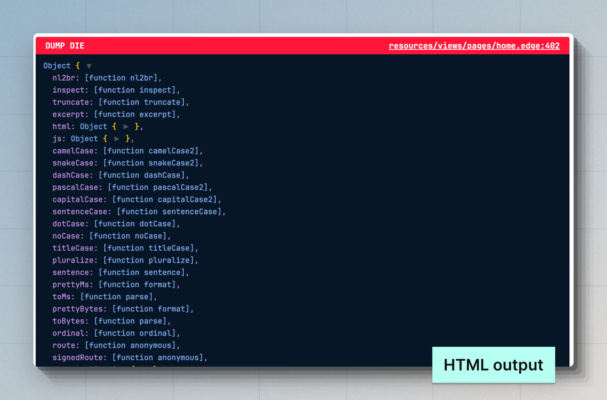

# Debugging
In this guide, we will explore multiple ways of debugging your AdonisJS applications, from using the VSCode debugger to using Dump and Die and viewing the debug logs of the framework.

## Debug using the VSCode debugger
Debugging AdonisJS applications using the VSCode debugger is straightforward. You only need to create a `.vscode/launch.json` file and use the Node.js debugger.

In the following example, we define a configuration to start the AdonisJS development server in the debug mode and then attach the VSCode debugger to it. 

See also: [VSCode Debugging Docs](https://code.visualstudio.com/docs/editor/debugging)

```json
// title: .vscode/launch.json
{
  "version": "0.2.0",
  "configurations": [
    {
      "type": "node",
      "request": "launch",
      "name": "Dev server",
      "program": "${workspaceFolder}/ace.js",
      "args": ["serve", "--hmr"],
      "skipFiles": ["<node_internals>/**"]
    }
  ]
}
```

To start debugging:

- Open the Command Palette with `(CMD + Shift + P)`.
- Search for **Debug: Select and Start Debugging**. You will find a list of launch options from the `.vscode/launch.json` file. 
- Select the **Dev server** option to run the HTTP server with the VSCode debugger.


### Debugging tests

You may define another launch option to run tests in the debug mode.

```json
// title: .vscode/launch.json
{
  "version": "0.2.0",
  "configurations": [
    {
      "type": "node",
      "request": "launch",
      "name": "Dev server",
      "program": "${workspaceFolder}/ace.js",
      "args": ["serve", "--hmr"],
      "skipFiles": ["<node_internals>/**"]
    },
    // insert-start
    {
      "type": "node",
      "request": "launch",
      "name": "Tests",
      "program": "${workspaceFolder}/ace.js",
      "args": ["test", "--watch"],
      "skipFiles": ["<node_internals>/**"]
    }
    // insert-end
  ]
}
```

### Debugging all other Ace commands
Defining individual launch options for every ace command is not a practical option. Therefore, you can define an `attach` configuration within the `.vscode/launch.json` file.

In `attach` mode, [VSCode will attach its debugger](https://code.visualstudio.com/blogs/2018/07/12/introducing-logpoints-and-auto-attach#_autoattaching-to-node-processes) with an already running Node.js process, given the process was started with the `--inspect` flag from within the VSCode integrated terminal.

Let's start by modifying the `.vscode/launch.json` file and adding the following configuration to it.

```json
// title: .vscode/launch.json
{
  "version": "0.2.0",
  "configurations": [
    // insert-start
    {
      "type": "node",
      "request": "attach",
      "name": "Attach Program",
      "port": 9229,
      "autoAttachChildProcesses": true,
      "skipFiles": ["<node_internals>/**"]
    },
    // insert-end
    {
      "type": "node",
      "request": "launch",
      "name": "Dev server",
      "program": "${workspaceFolder}/ace.js",
      "args": ["serve", "--hmr"],
      "skipFiles": ["<node_internals>/**"]
    },
    {
      "type": "node",
      "request": "launch",
      "name": "Tests",
      "program": "${workspaceFolder}/ace.js",
      "args": ["test", "--watch"],
      "skipFiles": ["<node_internals>/**"]
    }
  ]
}
```

To start debugging in attach mode:

- Open the Command Palette with `(CMD + Shift + P)`.
- Search for **Debug: Select and Start Debugging**. You will find a list of launch options from the `.vscode/launch.json` file.
- Select the **Attach Program** option.
- Run an Ace command with the `--inspect` flag. For example:
  ```sh
  node --inspect ace migration:run
  ```

::video{url="https://res.cloudinary.com/adonis-js/video/upload/v1726932262/n91xtzqavpdoro79lnza.mp4" controls="true"}


### Debugging Edge templates
You can debug Edge templates similar to your application code written in TypeScript. However, with Edge, you cannot use the breakpoints provided by VSCode. Instead, you must use the `@debugger` tag to define an in-code breakpoint.

:::note

The debugger will show the compiled output for Edge templates.

:::

```edge
@debugger
```

## Dump and Die
Dump and Die (known as `dd`) is similar to the most loved debugging technique, `console.log`. However, the `dd` helper will halt the execution by throwing an exception and displaying the output inside the browser or the terminal.

The output is rendered as an HTML document when you use the `dd` helper during an HTTP request. Otherwise, the output is displayed within the terminal.

```ts
// title: start/routes.ts
import User from '#models/user'
import router from '@adonisjs/core/services/router'
// highlight-start
import { dd } from '@adonisjs/core/services/dumper'
// highlight-end

router.get('/users', async () => {
  const users = await User.all()
  // highlight-start
  /**
   * Visit the "/users" endpoint to view the dumped values
   */
  dd(users)
  // highlight-end
  return users
})
```

The output of `dd` slightly differs from what you see when using `console.log`. 

- You can see the source code location where the value was dumped.
- You can view static properties of a class and prototype properties of an object.
- By default, nested values up to 10 levels deep are displayed.
- Support for multiple themes for the HTML output. You can choose between `nightOwl`, `catppuccin`, and `minLight`.




### Edge helpers for debugging
You can use the `dd` helper within Edge templates via the `@dd` tag. Additionally, you can use the `@dump` helper, which doesn't throw an exception and continues rendering the rest of the template.

```edge
{{-- Dump template state and die --}}
@dd(state)

{{-- Dump template state and continue rendering --}}
@dump(state)
```

When using the `@dump` helper make sure there is an [EdgeJS Stack](https://edgejs.dev/docs/stacks) named "dumper" on the page. The script and styles used by the `@dump` helper will be written to this stack for inclusion in the final HTML output.

```edge
<!DOCTYPE html>
  <html lang="en">
  <head>
    <meta charset="UTF-8" />
    <meta name="viewport" content="width=device-width, initial-scale=1.0" />
    @stack('dumper')
  </head>
  <body>
    @dump(state)
  </body>
</html>
```

### Dumper settings
You can configure the dumper settings inside the `config/app.ts` file. This file should export a `dumper` configuration object, as shown below.

```ts
// title: config/app.ts
/**
 * The global configuration used by the "dd" helper. You can
 * separately configure the settings for both the "console"
 * and the "html" printers.
 */
export const dumper = dumperConfig({
  /**
   * Settings for the console printer
   */
  console: {
    depth: 10,

    /**
     * Objects that should not be further expanded. The
     * array accepts an array of object constructor
     * names.
     */
    collapse: ['DateTime', 'Date'],
    inspectStaticMembers: true,
  },

  /**
   * Settings for the HTML printer
   */
  html: {
    depth: 10,
    inspectStaticMembers: true,
  },
})
```

<dl>

<dt> showHidden </dt>
<dd>

When set to `true`, the non-enumerable properties of an object will be processed. **Default: `false`**

</dd>

<dt> depth </dt>
<dd>

The depth at which to stop parsing nested values. The depth is shared among all tree-like data structures. For example, Objects, Arrays, Maps, and Sets. **Default: `5`**

</dd>

<dt> inspectObjectPrototype </dt>
<dd>

Inspect prototype properties of an object. The non-enumerable properties of the prototype are included by default. **Default: `'unless-plain-object'`**.

- When set to `true`, the prototype properties will be processed for all the objects.
- The prototype properties are never processed when set to `false`.
- When set to `'unless-plain-object'`, the prototype properties of class instances will be processed.

</dd>

<dt> inspectArrayPrototype </dt>
<dd>

Inspect prototype properties of an Array. **Default: `false`**.

</dd>

<dt> inspectStaticMembers </dt>
<dd>

Inspect static members of a class. Even though functions and classes are technically the same, this config only applies to functions defined using the `[class]` keyword. **Default: `false`**.

</dd>

<dt> maxArrayLength </dt>
<dd>

Maximum number of members to process for `Arrays`, `Maps`, and `Sets`. **Default: `100`**.

</dd>

<dt> maxStringLength </dt>
<dd>

Maximum number of characters to display for a string. **Default: `1000`**.

</dd>

<dt> collapse </dt>
<dd>

An array of object constructor names that should not be further inspected.

</dd>

</dl>

## Framework debug logs
You can view the framework debug logs using the `NODE_DEBUG` environment variable. The `NODE_DEBUG` flag is supported by the Node.js runtime, and you may use it to view logs for one or more modules using the module name.

For example, you can view logs for all AdonisJS packages using the `NODE_DEBUG="adonisjs:*"` value.

```sh
NODE_DEBUG="adonisjs:*" node ace serve --hmr
```

Similarly, you may use the `NODE_DEBUG` environment variable to view logs from the Node.js native modules like `fs`, `net`, `module`, and so on.

```sh
NODE_DEBUG="adonisjs:*,net,fs" node ace serve --hmr
```

<!-- ## Observing activities
Observing actions performed by different parts of your application can present some meaningful insights and help you debug and understand the inner workings of the framework.

### Lucid queries
You may debug Lucid queries by enabling the `debug` flag inside the `config/database.ts` file. Additionally, you must enable the `prettyPrintDebugQueries` within the same file to print SQL queries in the terminal.

```ts
// title: config/database.ts
const dbConfig = defineConfig({
  connection: 'sqlite',
  // insert-start
  prettyPrintDebugQueries: true,
  // insert-end
  connections: {
    sqlite: {
      client: 'better-sqlite3',
      connection: {
        filename: app.tmpPath('db.sqlite3'),
      },
      // insert-start
      debug: true,
      // insert-end
      useNullAsDefault: true,
      migrations: {
        naturalSort: true,
        paths: ['database/migrations'],
      },
    },
  },
})
```

 -->

<!-- ### Outgoing emails

### HTTP requests -->
