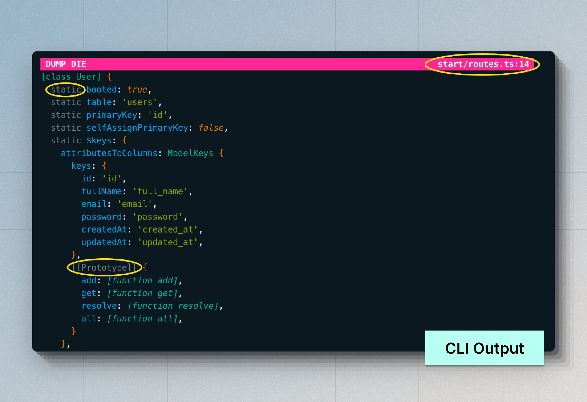

# Depuração
Neste guia, exploraremos várias maneiras de depurar seus aplicativos AdonisJS, desde o uso do depurador VSCode até o uso do Dump and Die e a visualização dos logs de depuração do framework.

## Depuração usando o depurador VSCode
A depuração de aplicativos AdonisJS usando o depurador VSCode é simples. Você só precisa criar um arquivo `.vscode/launch.json` e usar o depurador Node.js.

No exemplo a seguir, definimos uma configuração para iniciar o servidor de desenvolvimento AdonisJS no modo de depuração e, em seguida, anexar o depurador VSCode a ele.

[Documentos de depuração do VSCode](https://code.visualstudio.com/docs/editor/debugging)

```json
// title: .vscode/launch.json
{
  "version": "0.2.0",
  "configurations": [
    {
      "type": "node",
      "request": "launch",
      "name": "Dev server",
      "program": "${workspaceFolder}/ace.js",
      "args": ["serve", "--hmr"],
      "skipFiles": ["<node_internals>/**"]
    }
  ]
}
```

Para iniciar a depuração:

- Abra a Paleta de comandos com `(CMD + Shift + P)`.
- Pesquise por **Depurar: selecionar e iniciar a depuração**. Você encontrará uma lista de opções de inicialização no arquivo `.vscode/launch.json`.
- Selecione a opção **Servidor de desenvolvimento** para executar o servidor HTTP com o depurador do VSCode.


### Testes de depuração

Você pode definir outra opção de inicialização para executar testes no modo de depuração.

```json
// title: .vscode/launch.json
{
  "version": "0.2.0",
  "configurations": [
    {
      "type": "node",
      "request": "launch",
      "name": "Dev server",
      "program": "${workspaceFolder}/ace.js",
      "args": ["serve", "--hmr"],
      "skipFiles": ["<node_internals>/**"]
    },
    // insert-start
    {
      "type": "node",
      "request": "launch",
      "name": "Tests",
      "program": "${workspaceFolder}/ace.js",
      "args": ["test", "--watch"],
      "skipFiles": ["<node_internals>/**"]
    }
    // insert-end
  ]
}
```

### Depurando todos os outros comandos Ace
Definir opções de inicialização individuais para cada comando ace não é uma opção prática. Portanto, você pode definir uma configuração `attach` dentro do arquivo `.vscode/launch.json`.

No modo `attach`, [o VSCode anexará seu depurador](https://code.visualstudio.com/blogs/2018/07/12/introducing-logpoints-and-auto-attach#_autoattaching-to-node-processes) com um processo Node.js já em execução, dado que o processo foi iniciado com o sinalizador `--inspect` de dentro do terminal integrado do VSCode.

Vamos começar modificando o arquivo `.vscode/launch.json` e adicionando a seguinte configuração a ele.

```json
// title: .vscode/launch.json
{
  "version": "0.2.0",
  "configurations": [
    // insert-start
    {
      "type": "node",
      "request": "attach",
      "name": "Attach Program",
      "port": 9229,
      "autoAttachChildProcesses": true,
      "skipFiles": ["<node_internals>/**"]
    },
    // insert-end
    {
      "type": "node",
      "request": "launch",
      "name": "Dev server",
      "program": "${workspaceFolder}/ace.js",
      "args": ["serve", "--hmr"],
      "skipFiles": ["<node_internals>/**"]
    },
    {
      "type": "node",
      "request": "launch",
      "name": "Tests",
      "program": "${workspaceFolder}/ace.js",
      "args": ["test", "--watch"],
      "skipFiles": ["<node_internals>/**"]
    }
  ]
}
```

Para iniciar a depuração no modo de anexação:

- Abra a Paleta de Comandos com `(CMD + Shift + P)`.
- Procure por **Depurar: Selecionar e Iniciar Depuração**. Você encontrará uma lista de opções de inicialização no arquivo `.vscode/launch.json`.
- Selecione a opção **Attach Program**.
- Execute um comando Ace com o sinalizador `--inspect`. Por exemplo:
```sh
  node --inspect ace migration:run
  ```

::video{url="https://res.cloudinary.com/adonis-js/video/upload/v1726932262/n91xtzqavpdoro79lnza.mp4" controls="true"}


### Depurando modelos Edge
Você pode depurar modelos Edge semelhantes ao código do seu aplicativo escrito em TypeScript. No entanto, com o Edge, você não pode usar os pontos de interrupção fornecidos pelo VSCode. Em vez disso, você deve usar a tag `@debugger` para definir um ponto de interrupção no código.

:::note
O depurador mostrará a saída compilada para modelos Edge.
:::

```edge
@debugger
```

## Dump and Die
Dump and Die (conhecido como `dd`) é semelhante à técnica de depuração mais amada, `console.log`. No entanto, o auxiliar `dd` interromperá a execução lançando uma exceção e exibindo a saída dentro do navegador ou do terminal.

A saída é renderizada como um documento HTML quando você usa o auxiliar `dd` durante uma solicitação HTTP. Caso contrário, a saída é exibida dentro do terminal.

```ts
// title: start/routes.ts
import User from '#models/user'
import router from '@adonisjs/core/services/router'
// highlight-start
import { dd } from '@adonisjs/core/services/dumper'
// highlight-end

router.get('/users', async () => {
  const users = await User.all()
  // highlight-start
  /**
   * Visit the "/users" endpoint to view the dumped values
   */
  dd(users)
  // highlight-end
  return users
})
```

A saída de `dd` difere um pouco do que você vê ao usar `console.log`.

- Você pode ver o local do código-fonte onde o valor foi despejado.
- Você pode visualizar propriedades estáticas de uma classe e propriedades de protótipo de um objeto.
- Por padrão, valores aninhados de até 10 níveis de profundidade são exibidos.
- Suporte para vários temas para a saída HTML. Você pode escolher entre `nightOwl`, `catppuccin` e `minLight`.




### Ajudantes do Edge para depuração
Você pode usar o ajudante `dd` dentro dos modelos do Edge por meio da tag `@dd`. Além disso, você pode usar o ajudante `@dump`, que não gera uma exceção e continua renderizando o restante do modelo.

```edge
{{-- Dump template state and die --}}
@dd(state)

{{-- Dump template state and continue rendering --}}
@dump(state)
```

Ao usar o auxiliar `@dump`, certifique-se de que haja uma [pilha EdgeJS](https://edgejs.dev/docs/stacks) chamada "dumper" na página. O script e os estilos usados ​​pelo auxiliar `@dump` serão gravados nesta pilha para inclusão na saída HTML final.

```edge
<!DOCTYPE html>
  <html lang="en">
  <head>
    <meta charset="UTF-8" />
    <meta name="viewport" content="width=device-width, initial-scale=1.0" />
    @stack('dumper')
  </head>
  <body>
    @dump(state)
  </body>
</html>
```

### Configurações do Dumper
Você pode configurar as configurações do dumper dentro do arquivo `config/app.ts`. Este arquivo deve exportar um objeto de configuração `dumper`, conforme mostrado abaixo.

```ts
// title: config/app.ts
/**
 * The global configuration used by the "dd" helper. You can
 * separately configure the settings for both the "console"
 * and the "html" printers.
 */
export const dumper = dumperConfig({
  /**
   * Settings for the console printer
   */
  console: {
    depth: 10,

    /**
     * Objects that should not be further expanded. The
     * array accepts an array of object constructor
     * names.
     */
    collapse: ['DateTime', 'Date'],
    inspectStaticMembers: true,
  },

  /**
   * Settings for the HTML printer
   */
  html: {
    depth: 10,
    inspectStaticMembers: true,
  },
})
```

### `showHidden`

Quando definido como `true`, as propriedades não enumeráveis ​​de um objeto serão processadas. **Padrão: `false`**

### `depth`

A profundidade na qual parar de analisar valores aninhados. A profundidade é compartilhada entre todas as estruturas de dados semelhantes a árvores. Por exemplo, Objetos, Matrizes, Mapas e Conjuntos. **Padrão: `5`**

### `inspectObjectPrototype`

Inspecione propriedades de protótipo de um objeto. As propriedades não enumeráveis ​​do protótipo são incluídas por padrão. **Padrão: `'unless-plain-object'`**.

- Quando definido como `'true`, as propriedades de protótipo serão processadas para todos os objetos.
- As propriedades de protótipo nunca são processadas quando definidas como `false`.
- Quando definido como `'unless-plain-object'`, as propriedades de protótipo de instâncias de classe serão processadas.

### `inspectArrayPrototype`

Inspecione propriedades de protótipo de uma Matriz. **Padrão: `false`**.

### `inspectStaticMembers`

Inspecione membros estáticos de uma classe. Embora funções e classes sejam tecnicamente as mesmas, esta configuração se aplica somente a funções definidas usando a palavra-chave `[class]`. **Padrão: `false`**.

### `maxArrayLength`

Número máximo de membros a serem processados ​​para `Arrays`, `Maps` e `Sets`. **Padrão: `100`**.

### `maxStringLength`

Número máximo de caracteres a serem exibidos para uma string. **Padrão: `1000`**.

### `collapse`

Uma matriz de nomes de construtores de objetos que não devem ser inspecionados posteriormente.

## Logs de depuração do framework
Você pode visualizar os logs de depuração do framework usando a variável de ambiente `NODE_DEBUG`. O sinalizador `NODE_DEBUG` é suportado pelo tempo de execução do Node.js, e você pode usá-lo para visualizar logs de um ou mais módulos usando o nome do módulo.

Por exemplo, você pode visualizar logs para todos os pacotes AdonisJS usando o valor `NODE_DEBUG="adonisjs:*"`.

```sh
NODE_DEBUG="adonisjs:*" node ace serve --hmr
```

Da mesma forma, você pode usar a variável de ambiente `NODE_DEBUG` para visualizar logs dos módulos nativos do Node.js como `fs`, `net`, `module` e assim por diante.

```sh
NODE_DEBUG="adonisjs:*,net,fs" node ace serve --hmr
```
