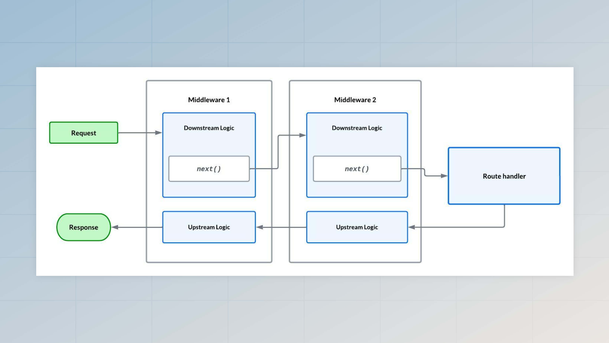

# Middleware

Middleware are a series of functions executed during an HTTP request before the request reaches the route handler. Every function in the chain can end the request or forward it to the next middleware.

A typical AdonisJS application uses middleware for **parsing request body**, **managing users sessions**, **authenticating requests**, **serving static assets**, etc.

You can also create custom middleware to perform additional tasks during an HTTP request.

## Middleware stacks

To give you better control over the execution of the middleware pipeline, AdonisJS split the middleware stack into following three groups.

### Server middleware stack

Server middleware runs on every HTTP request, even if you have not defined any route for the current request's URL.

They are great for adding additional functionality to your app that does not rely on the routing system of the framework. For example, the Static assets middleware is registered as server middleware.

You can register server middleware using the `server.use` method inside the `start/kernel.ts` file.

```ts
import server from '@adonisjs/core/services/server'

server.use([
  () => import('@adonisjs/static/static_middleware')
])
```

---

### Router middleware stack

Router middleware are also known as global middleware. They are executed on every HTTP request that has a matching route.

The Bodyparser, auth, and session middleware are registered under the router middleware stack.

You can register router middleware using the `router.use` method inside the `start/kernel.ts` file.

```ts
import router from '@adonisjs/core/services/router'

router.use([
  () => import('@adonisjs/core/bodyparser_middleware')
])
```

---

### Named middleware collection

Named middleware is a collection of middleware that are not executed unless explicitly assigned to a route or a group.

Instead of defining middleware as an inline callback within the routes file, we recommend you create dedicated middleware classes, store them inside the named middleware collection and then assign them to the routes.

You can define named middleware using the `router.named` method inside the `start/kernel.ts` file. Make sure to export the named collection to be able to use it [inside the routes file](#assigning-middleware-to-routes-and-route-groups).

```ts
import router from '@adonisjs/core/services/router'

router.named({
  auth: () => import('#middleware/auth_middleware')
})
```

## Creating middleware

Middleware are stored inside the `./app/middleware` directory, and you can create a new middleware file by running the `make:middleware` ace command.

See also: [Make middleware command](../references/commands.md#makemiddleware)

```sh
node ace make:middleware user_location
```

The above command will create the `user_location_middleware.ts` file under the middleware directory. 

A middleware is represented as a class with the `handle` method. During execution, AdonisJS will automatically call this method and give it the [HttpContext](../concepts/http_context.md) as the first argument.

```ts
// title: app/middleware/user_location_middleware.ts
import { HttpContext } from '@adonisjs/core/http'
import { NextFn } from '@adonisjs/core/types/http'

export default class UserLocationMiddleware {
  async handle(ctx: HttpContext, next: NextFn) {
  }
}
```

Within the `handle` method, a middleware has to decide whether to continue with the request, finish the request by sending a response or raise an exception to abort the request.


### Abort request

If a middleware raises an exception, all the upcoming middleware and the route handler will not be executed, and the exception will be given to the global exception handler.

```ts
import { Exception } from '@adonisjs/core/exceptions'
import { NextFn } from '@adonisjs/core/types/http'

export default class UserLocationMiddleware {
  async handle(ctx: HttpContext, next: NextFn) {
    throw new Exception('Aborting request')
  }
}
```


### Continue with the request

You must call the `next` method to continue with the request. Otherwise, the rest of the actions inside the middleware stack will not be executed.

```ts
export default class UserLocationMiddleware {
  async handle(ctx: HttpContext, next: NextFn) {
    // Call the `next` function to continue
    await next()      
  }
}
```

### Send a response, and do not call the `next` method

Finally, you can end the request by sending the response. In this case, do not call the `next` method.


```ts
export default class UserLocationMiddleware {
  async handle(ctx: HttpContext, next: NextFn) {
    // send response + do not call next
    ctx.response.send('Ending request')
  }
}
```

## Assigning middleware to routes and route groups

The named middleware collection is unused by default, and you must explicitly assign them to routes or the route groups.

In the following example, we first import the `middleware` collection and assign the `userLocation` middleware to a route.

```ts
import router from '@adonisjs/core/services/router'
import { middleware } from '#start/kernel'

router
  .get('posts', () => {})
  .use(middleware.userLocation())
```

Multiple middleware can be applied either as an array or by calling the `use` method multiple times.

```ts
router
  .get('posts', () => {})
  .use([
    middleware.userLocation(),
    middleware.auth()
  ])
```

Similarly, you can assign middleware to a route group as well. The group middleware will be applied to all group routes automatically.

```ts
import router from '@adonisjs/core/services/router'
import { middleware } from '#start/kernel'

router.group(() => {

  router.get('posts', () => {})
  router.get('users', () => {})
  router.get('payments', () => {})

}).use(middleware.userLocation())
```

## Middleware parameters

Middleware registered under the named middleware collection can accept an additional parameter as part of the `handle` method arguments. For example, the `auth` middleware accepts the authentication guard as a configuration option.

```ts
type AuthGuards = 'web' | 'api'

export default class AuthMiddleware {
  async handle(ctx, next, options: { guard: AuthGuards }) {
  }
}
```

When assigning the middleware to the route, you can specify the guard to use.

```ts
import router from '@adonisjs/core/services/router'
import { middleware } from '#start/kernel'

router.get('payments', () => {}).use(
  middleware.auth({ guard: 'web' })
)
```

## Dependency injection 

Middleware classes are instantiated using the [IoC container](../concepts/dependency_injection.md); therefore, you can type-hint dependencies inside the middleware constructor, and the container will inject them for you.

Given you have a `GeoIpService` class to look up user location from the request IP, you can inject it into the middleware using the `@inject` decorator.

```ts
// title: app/services/geoip_service.ts
export class GeoIpService {
  async lookup(ipAddress: string) {
    // lookup location and return
  }
}
```

```ts
import { inject } from '@adonisjs/core'
import { GeoIpService } from '#services/geoip_service'
import type { HttpContext } from '@adonisjs/core/http'
import type { NextFn } from '@adonisjs/core/types/http'

@inject()
export default class UserLocationMiddleware {
  constructor(protected geoIpService: GeoIpService) {
  }

  async handle(ctx: HttpContext, next: NextFn) {
    const ip = ctx.request.ip()
    ctx.location = await this.geoIpService.lookup(ip)
  }
}
```


## Middleware execution flow

The middleware layer of AdonisJS is built on top of [Chain of Responsibility](https://refactoring.guru/design-patterns/chain-of-responsibility) design pattern. A middleware has two execution phases: the **downstream phase** and the **upstream phase**.

- The downstream phase is the block of code you write before calling the `next` method. In this phase, you handle the request.
- The upstream phase is the block of code you might write after calling the `next` method. In this phase, you can inspect the response or change it completely. 



## Middleware and exception handling

AdonisJS automatically captures the exception raised by the middleware pipeline or the route handler and converts it into an HTTP response using the [global exception handler](./exception_handling.md).

As a result, you do not have to wrap the `next` function calls inside a `try/catch` statement. Also, the automatic exception handling ensures that the upstream logic of middleware is always executed after the `next` function call.

## Mutating response from a middleware

The upstream phase of middleware can mutate the response body, headers, and status code. Doing so will discard the old response set by the route handler or any other middleware.

Before mutating the response, you must ensure you are dealing with the correct response type. Following is the list of response types in the `Response` class.

- **Standard response** refers to sending data values using the `response.send` method. Its value might be an `Array`, `Object`, `String`, `Boolean`, or `Buffer`.
- **Streaming response** refers to piping a stream to the response socket using the `response.stream` method. 
- **File download response** refers to downloading a file using the `response.download` method.

You will/will not have access to specific response properties based on the kind of response.

### Dealing with a standard response

When mutating a standard response, you can access it using the `response.content` property. Make sure first to check if the `content` exists or not.

```ts
import { HttpContext } from '@adonisjs/core/http'
import { NextFn } from '@adonisjs/core/types/http'

export default class {
  async handle({ response }: HttpContext, next: NextFn) {
    await next()
    
    if (response.hasContent) {
      console.log(response.content)
      console.log(typeof response.content)
      
      response.send(newResponse)
    }
  }
}
```

### Dealing with a streaming response

Response streams set using the `response.stream` method are not immediately piped to the outgoing [HTTP response](https://nodejs.org/api/http.html#class-httpserverresponse). Instead, AdonisJS waits for the route handler and the middleware pipeline to finish.

As a result, inside a middleware, you can replace the existing stream with a new stream or define event handlers to monitor the stream.

```ts
import { HttpContext } from '@adonisjs/core/http'
import { NextFn } from '@adonisjs/core/types/http'

export default class {
  async handle({ response }: HttpContext, next: NextFn) {
    await next()
    
    if (response.hasStream) {
      response.outgoingStream.on('data', (chunk) => {
        console.log(chunk)
      })
    }
  }
}
```

### Dealing with file downloads

The file downloads performed using the `response.download`, and `response.attachment` methods defer the download process until the route handler and the middleware pipeline finish.

As a result, inside a middleware, you can replace the path for the file to download.

```ts
import { HttpContext } from '@adonisjs/core/http'
import { NextFn } from '@adonisjs/core/types/http'

export default class {
  async handle({ response }: HttpContext, next: NextFn) {
    await next()
    
    if (response.hasFileToStream) {
      console.log(response.fileToStream.generateEtag)
      console.log(response.fileToStream.path)
    }
  }
}
```

## Testing middleware classes

Creating middleware as classes allows you to easily test a middleware in isolation (aka unit test a middleware). There are a few different ways to test middleware. Let's explore all the available options.

The simplest option is to create a new instance of the middleware class and invoke the `handle` method with the HTTP context and `next` callback function.

```ts
import testUtils from '@adonisjs/core/services/test_utils'
import GeoIpService from '#services/geoip_service'
import UserLocationMiddleware from '#middleware/user_location_middleware'

const middleware = new UserLocationMiddleware(
  new GeoIpService()
)

const ctx = testUtils.createHttpContext()
await middleware.handle(ctx, () => {
  console.log('Next function invoked')
})
```

The `testUtils` service is available only after the AdonisJS application is booted. However, if you are testing a middleware inside a package, you can use the `HttpContextFactory` class to create a dummy HTTP context instance without booting an application.

See also: [CORS middleware test](https://github.com/adonisjs/cors/blob/main/tests/cors_middleware.spec.ts#L24-L41) for a real-world example.

```ts
import {
  RequestFactory,
  ResponseFactory,
  HttpContextFactory
} from '@adonisjs/core/factories/http'

const request = new RequestFactory().create()
const response = new ResponseFactory().create()
const ctx = new HttpContextFactory()
  .merge({ request, response })
  .create()

await middleware.handle(ctx, () => {
  console.log('Next function invoked')
})
```


### Using server pipeline

If your middleware relies on other middleware to be executed first, you may compose a pipeline of middleware using the `server.pipeline` method.

- The `server.pipeline` method accepts an array of middleware classes.
- The class instance is created using the IoC container.
- The execution flow is the same as the original execution flow of middleware during an HTTP request.

```ts
import testUtils from '@adonisjs/core/services/test_utils'
import server from '@adonisjs/core/services/server'
import UserLocationMiddleware from '#middleware/user_location_middleware'

const pipeline = server.pipeline([
  UserLocationMiddleware
])

const ctx = testUtils.createHttpContext()
await pipeline.run(ctx)
```

You can define the `finalHandler` and `errorHandler` functions before calling the `pipeline.run` method. 

- The final handler is executed after all the middleware has been executed. The final handler is not executed when any middleware ends the chain without calling the `next` method.
- The error handler is executed if a middleware raises an exception. The upstream flow will start after the error handler is invoked.

```ts
const ctx = testUtils.createHttpContext()

await pipeline
 .finalHandler(() => {
   console.log('all middleware called next')
   console.log('the upstream logic starts from here')
 })
 .errorHandler((error) => {
   console.log('an exception was raised')
   console.log('the upstream logic starts from here')
 })
 .run(ctx)
 
console.log('pipeline executed')
```

The `server` service is available after the application is booted. However, if you are creating a package, you can use the `ServerFactory` to create an instance of the Server class without booting the application.

```ts
import { ServerFactory } from '@adonisjs/core/factories/http'

const server = new ServerFactory().create()
const pipeline = server.pipeline([
  UserLocationMiddleware
])
```
