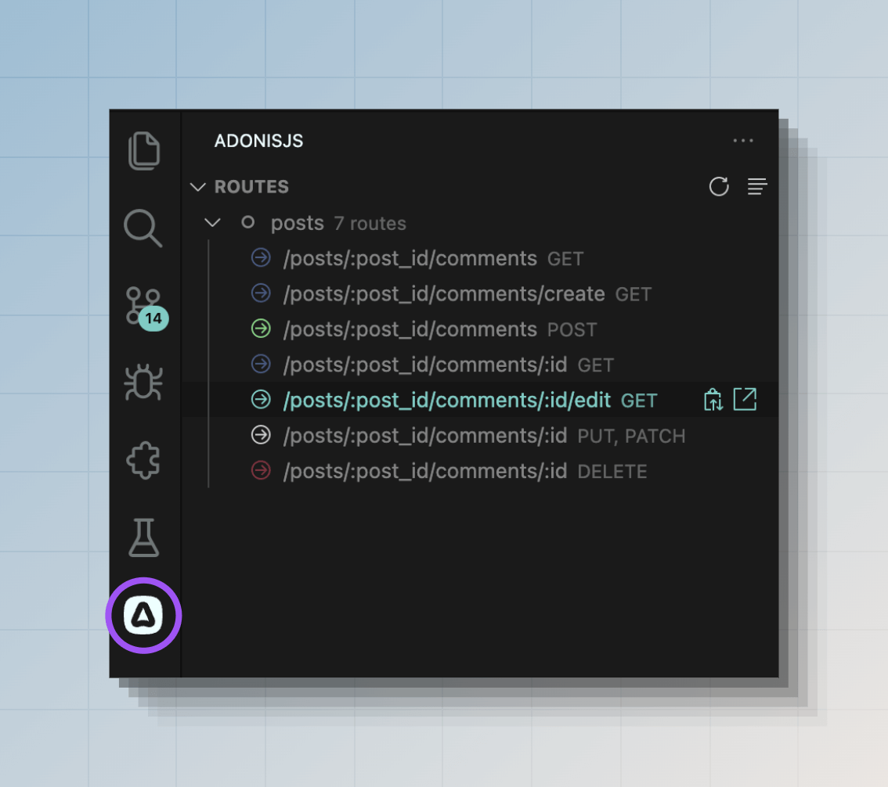

# Roteamento

Os usuários do seu site ou aplicativo da web podem visitar diferentes URLs como `/`, `/about` ou `/posts/1`. Para fazer essas URLs funcionarem, você precisa definir rotas.

No AdonisJS, as rotas são definidas dentro do arquivo `start/routes.ts`. Uma rota é uma combinação de um **padrão de URI** e um **manipulador** para manipular solicitações para essa rota específica. Por exemplo:

```ts
// title: start/routes.ts
import router from '@adonisjs/core/services/router'

router.get('/', () => {
  return 'Hello world from the home page.'
})

router.get('/about', () => {
  return 'This is the about page.'
})

router.get('/posts/:id', ({ params }) => {
  return `This is post with id ${params.id}`
})
```

A última rota no exemplo acima usa um padrão de URI dinâmico. O `:id` é uma maneira de dizer ao roteador para aceitar qualquer valor para o id. Nós os chamamos de **parâmetros de rota**.

## Ver lista de rotas registradas
Você pode executar o comando `list:routes` para visualizar a lista de rotas registradas pelo seu aplicativo.

```sh
node ace list:routes
```

Além disso, você pode ver a lista de rotas na barra de atividades do VSCode, se estiver usando nossa [extensão oficial do VSCode](https://marketplace.visualstudio.com/items?itemName=jripouteau.adonis-vscode-extension).



## Parâmetros de rota

Os parâmetros de rota permitem que você defina URIs que podem aceitar valores dinâmicos. Cada parâmetro captura o valor de um segmento de URI, e você pode acessar esse valor dentro do manipulador de rota.

Um parâmetro de rota sempre começa com dois pontos `:`, seguido pelo nome do parâmetro.

```ts
// title: start/routes.ts
import router from '@adonisjs/core/services/router'

router.get('/posts/:id', ({ params }) => {
  return params.id
})
```

| URL              | Id        |
|------------------|-----------|
| `/posts/1`       | `1`       |
| `/posts/100`     | `100`     |
| `/posts/foo-bar` | `foo-bar` |

Um URI também pode aceitar múltiplos parâmetros. Cada parâmetro deve ter um nome exclusivo.

```ts
// title: start/routes.ts
import router from '@adonisjs/core/services/router'

router.get('/posts/:id/comments/:commentId', ({ params }) => {
  console.log(params.id)
  console.log(params.commentId)
})
```

| URL                          | Id        | Comment Id |
|------------------------------|-----------|------------|
| `/posts/1/comments/4`        | `1`       | `4`        |
| `/posts/foo-bar/comments/22` | `foo-bar` | `22`       |

### Parâmetros opcionais

Os parâmetros de rota também podem ser opcionais, acrescentando um ponto de interrogação `?` no final do nome do parâmetro. Os parâmetros opcionais devem vir depois dos parâmetros obrigatórios.

```ts
// title: start/routes.ts
import router from '@adonisjs/core/services/router'

router.get('/posts/:id?', ({ params }) => {
  if (!params.id) {
    return 'Showing all posts'
  }

  return `Showing post with id ${params.id}`
})
```

### Parâmetros curinga

Para capturar todos os segmentos de um URI, você pode definir um parâmetro curinga. O parâmetro curinga é especificado usando uma palavra-chave especial `*` e deve ser definido na última posição.

```ts
// title: start/routes.ts
import router from '@adonisjs/core/services/router'

router.get('/docs/:category/*', ({ params }) => {
  console.log(params.category)
  console.log(params['*'])
})
```

| URL                  | Category | Wildcard param   |
|----------------------|----------|------------------|
| `/docs/http/context` | `http`   | `['context']`    |
| `/docs/api/sql/orm`  | `api`    | `['sql', 'orm']` |

### Correspondentes de parâmetros

O roteador não sabe o formato dos dados de parâmetros que você deseja aceitar. Por exemplo, uma solicitação com URI `/posts/foo-bar` e `/posts/1` corresponderá à mesma rota. No entanto, você pode validar explicitamente os valores de parâmetros usando correspondentes de parâmetros.

Um correspondente é registrado encadeando o método `where()`. O primeiro argumento é o nome do parâmetro e o segundo argumento é o objeto correspondente.

No exemplo a seguir, definimos um regex para validar o id como um número válido. A rota será ignorada caso a validação falhe.

```ts
// title: start/routes.ts
import router from '@adonisjs/core/services/router'

router
  .get('/posts/:id', ({ params }) => {})
  .where('id', {
    match: /^[0-9]+$/,
  })
```

Juntamente com o regex `match`, você também pode definir uma função `cast` para converter o valor do parâmetro em seu tipo de dados correto. Neste exemplo, podemos converter o id em um número.

```ts
// title: start/routes.ts
import router from '@adonisjs/core/services/router'

router
  .get('/posts/:id', ({ params }) => {
    console.log(typeof params.id)
  })
  .where('id', {
    match: /^[0-9]+$/,
    cast: (value) => Number(value),
  })
```

### Correspondentes embutidos

O roteador é fornecido com os seguintes métodos auxiliares para tipos de dados comumente usados.

```ts
// title: start/routes.ts
import router from '@adonisjs/core/services/router'

// Validate id to be numeric + cast to number data type
router.where('id', router.matchers.number())

// Validate id to be a valid UUID
router.where('id', router.matchers.uuid())

// Validate slug to match a given slug regex: regexr.com/64su0
router.where('slug', router.matchers.slug())
```

### Correspondentes globais

Os correspondentes de rota podem ser definidos globalmente na instância do roteador. A menos que explicitamente substituído no nível da rota, um correspondente global é aplicado em todas as rotas.

```ts
// title: start/routes.ts
import router from '@adonisjs/core/services/router'

// Global matcher
router.where('id', router.matchers.uuid())

router
  .get('/posts/:id', () => {})
  // Overridden at route level
  .where('id', router.matchers.number())
```

## Métodos HTTP

O método `router.get()` cria uma rota que responde ao [método HTTP GET](https://developer.mozilla.org/en-US/docs/Web/HTTP/Methods/GET). Da mesma forma, você pode usar os seguintes métodos para registrar rotas para diferentes métodos HTTP.

```ts
// title: start/routes.ts
import router from '@adonisjs/core/services/router'

// GET method
router.get('users', () => {})

// POST method
router.post('users', () => {})

// PUT method
router.put('users/:id', () => {})

// PATCH method
router.patch('users/:id', () => {})

// DELETE method
router.delete('users/:id', () => {})
```

Você pode usar o método `router.any()` para criar uma rota que responde a todos os métodos HTTP padrão.

```ts
// title: start/routes.ts
router.any('reports', () => {})
```

Finalmente, você pode criar uma rota para métodos HTTP personalizados usando o método `router.route()`.

```ts
// title: start/routes.ts
router.route('/', ['TRACE'], () => {})
```

## Manipulador de roteador

O manipulador de rota manipula a solicitação retornando uma resposta ou gerando uma exceção para abortar a solicitação.

Um manipulador pode ser um retorno de chamada em linha (como visto neste guia) ou uma referência a um método de controlador.

```ts
// title: start/routes.ts
router.post('users', () => {
  // Do something
})
```

:::note
Os manipuladores de rota podem ser funções assíncronas, e o AdonisJS manipulará a resolução de promessa automaticamente.
:::

No exemplo a seguir, importamos a classe `UsersController` e a vinculamos à rota. Durante uma solicitação HTTP, o AdonisJS criará uma instância da classe de controlador usando o contêiner IoC e executará o método `store`.

Veja também: Guia dedicado em [controladores](./controllers.md).

```ts
// title: start/routes.ts
const UsersController = () => import('#controllers/users_controller')

router.post('users', [UsersController, 'store'])
```

## Middleware de rota

Você pode definir um middleware em uma rota encadeando o método `use()`. O método aceita um retorno de chamada em linha ou uma referência a um middleware nomeado.

A seguir está um exemplo mínimo de definição de um middleware de rota. Recomendamos a leitura do [guia dedicado em middleware](./middleware.md) para explorar todas as opções disponíveis e o fluxo de execução do middleware.

```ts
// title: start/routes.ts
router
  .get('posts', () => {
    console.log('Inside route handler')

    return 'Viewing all posts'
  })
  .use((_, next) => {
    console.log('Inside middleware')
    return next()
  })
```

## Identificador de rota

Cada rota tem um identificador exclusivo que você pode usar para referenciar a rota em outro lugar em seu aplicativo. Por exemplo, você pode gerar uma URL para uma rota usando o [URL builder](#url-builder) ou redirecionar para uma rota usando o método [`response.redirect()`](./response.md#redirects).

Por padrão, o padrão de rota é o identificador de rota. No entanto, você pode atribuir um nome exclusivo e memorável à rota usando o método `route.as`.

```ts
// title: start/routes.ts
router.get('users', () => {}).as('users.index')

router.post('users', () => {}).as('users.store')

router.delete('users/:id', () => {}).as('users.delete')
```

Agora você pode construir URLs usando o nome da rota em seus modelos ou usando o construtor de URL.

```ts
const url = router.builder().make('users.delete', [user.id])
```

```edge
<form
  method='POST'
  action="{{
    route('users.delete', [user.id], { formAction: 'delete' })
  }}"
></form>
```

## Agrupando rotas

Grupos de rotas oferecem uma camada de conveniência para configuração em massa aninhada dentro de um grupo. Você pode criar um grupo de rotas usando o método `router.group`.

```ts
// title: start/routes.ts
router.group(() => {
  /**
   * All routes registered inside the callback
   * are part of the surrounding group
   */
  router.get('users', () => {})
  router.post('users', () => {})
})
```

Grupos de rotas podem ser aninhados uns dentro dos outros, e o AdonisJS mesclará ou substituirá propriedades com base no comportamento da configuração aplicada.

```ts
// title: start/routes.ts
router.group(() => {
  router.get('posts', () => {})

  router.group(() => {
    router.get('users', () => {})
  })
})
```

### Prefixando rotas dentro de um grupo

O padrão URI de rotas dentro de um grupo pode ser prefixado usando o método `group.prefix`. O exemplo a seguir criará rotas para os padrões URI `/api/users` e `/api/payments`.

```ts
// title: start/routes.ts
router
  .group(() => {
    router.get('users', () => {})
    router.get('payments', () => {})
  })
  .prefix('/api')
```

No caso de grupos aninhados, o prefixo será aplicado do grupo externo para o interno. O exemplo a seguir criará rotas para os padrões URI `/api/v1/users` e `/api/v1/payments`.

```ts
// title: start/routes.ts
router
  .group(() => {
    router
      .group(() => {
        router.get('users', () => {})
        router.get('payments', () => {})
      })
      .prefix('v1')
  })
  .prefix('api')
```

### Nomeando rotas dentro de um grupo

Semelhante a prefixar o padrão de rota, você também pode prefixar os nomes de rota dentro de um grupo usando o método `group.as`.

:::note
As rotas dentro de um grupo devem ter nomes antes que você possa prefixá-las.
:::

```ts
// title: start/routes.ts
router
  .group(() => {
    route
      .get('users', () => {})
      .as('users.index') // final name - api.users.index
  })
  .prefix('api')
  .as('api')
```

No caso de grupos aninhados, os nomes serão prefixados do grupo externo para o interno.

```ts
// title: start/routes.ts
router
  .group(() => {
    route
      .get('users', () => {})
      .as('users.index') // api.users.index

    router
      .group(() => {
        route
          .get('payments', () => {})
          .as('payments.index') // api.commerce.payments.index
      })
      .as('commerce')
  })
  .prefix('api')
  .as('api')
```

### Aplicando middleware a rotas dentro de um grupo

Você pode atribuir middleware a rotas dentro de um grupo usando o método `group.use`. O middleware do grupo é executado antes do middleware aplicado em rotas individuais dentro do grupo.

No caso de grupos aninhados, o middleware do grupo mais externo será executado primeiro. Em outras palavras, um grupo adiciona o middleware à pilha de middleware da rota.

Veja também: [Guia de middleware](./middleware.md)

```ts
// title: start/routes.ts
router
  .group(() => {
    router
      .get('posts', () => {})
      .use((_, next) => {
        console.log('logging from route middleware')
        return next()
      })
  })
  .use((_, next) => {
    console.log('logging from group middleware')
    return next()
  })
```

## Registrando rotas para um domínio específico

O AdonisJS permite que você registre rotas sob um nome de domínio específico. Isso é útil quando você tem um aplicativo mapeado para vários domínios e deseja rotas diferentes para cada domínio.

No exemplo a seguir, definimos dois conjuntos de rotas.

- Rotas que são resolvidas para qualquer domínio/nome de host.
- Rotas que são correspondidas quando o domínio/nome de host corresponde ao valor do nome de domínio predefinido.

```ts
// title: start/routes.ts
router.group(() => {
  router.get('/users', () => {})
  router.get('/payments', () => {})
})

router.group(() => {
  router.get('/articles', () => {})
  router.get('/articles/:id', () => {})
}).domain('blog.adonisjs.com')
```

Depois de implantar seu aplicativo, as rotas sob o grupo com um domínio explícito só serão correspondidas se o nome do host da solicitação for `blog.adonisjs.com`.

### Subdomínios dinâmicos

Você pode especificar subdomínios dinâmicos usando o método `group.domain`. Semelhante aos parâmetros de rota, o segmento dinâmico de um domínio começa com dois pontos `:`.

No exemplo a seguir, o segmento `tenant` aceita qualquer subdomínio, e você pode acessar seu valor usando o objeto `HttpContext.subdomains`.

```ts
// title: start/routes.ts
router
 .group(() => {
   router.get('users', ({ subdomains }) => {
     return `Listing users for ${subdomains.tenant}`
   })
 })
 .domain(':tenant.adonisjs.com')
```

## Renderizar visualização Edge de uma rota

Você pode usar o método `router.on().render()` se tiver um manipulador de rota que renderize apenas uma visualização. É um atalho conveniente para renderizar uma visualização sem definir um manipulador explícito.

O método render aceita o nome do modelo edge a ser renderizado. Opcionalmente, você pode passar os dados do modelo como o segundo argumento.

:::warning
O método `route.on().render()` só existe quando você configurou o [provedor de serviços Edge](../views-and-templates/edgejs.md)
:::

```ts
// title: start/routes.ts
import router from '@adonisjs/core/services/router'

router.on('/').render('home')
router.on('about').render('about', { title: 'About us' })
router.on('contact').render('contact', { title: 'Contact us' })
```

## Renderizar a visualização Inertia de uma rota

Se você estiver usando o adaptador Inertia.js, poderá usar o método `router.on().renderInertia()` para renderizar uma visualização Inertia. É um atalho conveniente para renderizar uma visualização sem definir um manipulador explícito.

O método renderInertia aceita o nome do componente Inertia a ser renderizado. Opcionalmente, você pode passar os dados do componente como o segundo argumento.

:::warning
O método `route.on().renderInertia()` só existe quando você configurou o [provedor de serviços Inertia](../views-and-templates/inertia.md)
:::

```ts
// title: start/routes.ts
import router from '@adonisjs/core/services/router'

router.on('/').renderInertia('home')
router.on('about').renderInertia('about', { title: 'About us' })
router.on('contact').renderInertia('contact', { title: 'Contact us' })
```

## Redirecionar de uma rota

Se você estiver definindo um manipulador de rota para redirecionar a solicitação para outro caminho ou rota, você pode usar os métodos `router.on().redirect()` ou `router.on().redirectToPath()`.

O método `redirect` aceita o identificador de rota. Enquanto o método `redirectToPath` aceita um caminho/URL estático.

```ts
// title: start/routes.ts
import router from '@adonisjs/core/services/router'

// Redirect to a route
router.on('/posts').redirect('/articles')

// Redirect to a URL
router.on('/posts').redirectToPath('https://medium.com/my-blog')
```

### Parâmetros de encaminhamento

No exemplo a seguir, o valor de `id` da solicitação original será usado para construir a rota `/articles/:id`. Então, se uma requisição vier para `/posts/20`, ela será redirecionada para `/articles/20`.

```ts
// title: start/routes.ts
import router from '@adonisjs/core/services/router'

router.on('/posts/:id').redirect('/articles/:id')
```

### Especificando parâmetros explicitamente

Você também pode especificar os parâmetros de rota explicitamente como o segundo argumento. Neste caso, os parâmetros da requisição atual serão ignorados.

```ts
// title: start/routes.ts
import router from '@adonisjs/core/services/router'

// Always redirect to /articles/1
router.on('/posts/:id').redirect('/articles/:id', {
  id: 1
})
```

### Com string de consulta

A string de consulta para a URL de redirecionamento pode ser definida dentro do objeto options.

```ts
// title: start/routes.ts
import router from '@adonisjs/core/services/router'

router.on('/posts').redirect('/articles', {
  qs: {
    limit: 20,
    page: 1,
  }  
})
```

## Rota da requisição atual

A rota da requisição atual pode ser acessada usando a propriedade [`HttpContext.route`](../concepts/http_context.md#http-context-properties). Ela inclui o **padrão de rota**, **nome**, **referência ao seu armazenamento de middleware** e **referência ao manipulador de rota**.

```ts
// title: start/routes.ts
router.get('payments', ({ route }) => {
  console.log(route)
})
```

Você também pode verificar se a solicitação atual é para uma rota específica ou não usando o método `request.matchesRoute`. O método aceita o padrão URI da rota ou o nome da rota.

```ts
// title: start/routes.ts
router.get('/posts/:id', ({ request }) => {
  if (request.matchesRoute('/posts/:id')) {
  }
})
```

```ts
// title: start/routes.ts
router
  .get('/posts/:id', ({ request }) => {
    if (request.matchesRoute('posts.show')) {
    }
  })
  .as('posts.show')
```

Você também pode corresponder a várias rotas. O método retornará true assim que encontrar a primeira correspondência.

```ts
if (request.matchesRoute(['/posts/:id', '/posts/:id/comments'])) {
  // do something
}
```

## Como o AdonisJS corresponde às rotas

As rotas são correspondidas na mesma ordem em que são registradas dentro do arquivo de rotas. Começamos a correspondência da rota mais alta e paramos na primeira rota correspondente.

Se você tiver duas rotas semelhantes, primeiro deve registrar a rota mais específica.

No exemplo a seguir, a solicitação para a URL `/posts/archived` será tratada pela primeira rota (ou seja, `/posts/:id` ) porque o parâmetro dinâmico `id` capturará o valor `archived`.

```ts
// title: start/routes.ts
import router from '@adonisjs/core/services/router'

router.get('posts/:id', () => {})
router.get('posts/archived', () => {})
```

Esse comportamento pode ser corrigido reordenando as rotas colocando a rota mais específica antes da rota com um parâmetro dinâmico.

```ts
// title: start/routes.ts
router.get('posts/archived', () => {})
router.get('posts/:id', () => {})
```

### Lidando com solicitações 404

O AdonisJS gera uma exceção 404 quando nenhuma rota correspondente é encontrada para a URL da solicitação atual.

Para exibir uma página 404 para o usuário, você pode capturar a exceção `E_ROUTE_NOT_FOUND` dentro do [manipulador de exceção global](./exception_handling.md) e renderizar um modelo.

```ts
// app/exceptions/handler.ts
import { errors } from '@adonisjs/core'
import { HttpContext, ExceptionHandler } from '@adonisjs/core/http'

export default class HttpExceptionHandler extends ExceptionHandler {
  async handle(error: unknown, ctx: HttpContext) {
    if (error instanceof errors.E_ROUTE_NOT_FOUND) {
      return ctx.view.render('errors/404')
    }
    
    return super.handle(error, ctx)
  }
}
```

## Construtor de URL

Você pode usar o construtor de URL para criar URLs para rotas predefinidas em seu aplicativo. Por exemplo, crie uma URL de ação de formulário dentro de modelos do Edge ou crie a URL para redirecionar a solicitação para outra rota.

O método `router.builder` cria uma instância da classe [URL builder](https://github.com/adonisjs/http-server/blob/main/src/router/lookup_store/url_builder.ts), e você pode usar a API fluente do builder para procurar uma rota e criar uma URL para ela.

```ts
// title: start/routes.ts
import router from '@adonisjs/core/services/router'
const PostsController = () => import('#controllers/posts_controller')

router
  .get('posts/:id', [PostsController, 'show'])
  .as('posts.show')
```

Você pode gerar a URL para a rota `posts.show` da seguinte forma.

```ts
// title: start/routes.ts
import router from '@adonisjs/core/services/router'

router
  .builder()
  .params([1])
  .make('posts.show') // /posts/1

router
 .builder()
 .params([20])
 .make('posts.show') // /posts/20
```

Os parâmetros podem ser especificados como uma matriz de argumentos posicionais. Ou você pode defini-los como um par chave-valor.

```ts
// title: start/routes.ts
router
 .builder()
 .params({ id: 1 })
 .make('posts.show') // /posts/1
```

### Definindo parâmetros de consulta

Os parâmetros de consulta podem ser definidos usando o método `builder.qs`. O método aceita um objeto de par chave-valor e o serializa para uma string de consulta.

```ts
// title: start/routes.ts
router
  .builder()
  .qs({ page: 1, sort: 'asc' })
  .make('posts.index') // /posts?page=1&sort=asc
```

A sequência de consulta é serializada usando o pacote npm [qs](https://www.npmjs.com/package/qs). Você pode [configurar suas configurações](https://github.com/adonisjs/http-server/blob/main/src/define_config.ts#L49-L54) dentro do arquivo `config/app.ts` sob o objeto `http`.

```ts
// title: config/app.js
http: defineConfig({
  qs: {
    stringify: {
      // 
    }
  }
})
```

### Prefixando URL

Você pode prefixar uma URL base para a saída usando o método `builder.prefixUrl`.

```ts
// title: start/routes.ts
router
  .builder()
  .prefixUrl('https://blog.adonisjs.com')
  .params({ id: 1 })
  .make('posts.show')
```

### Gerando URLs assinadas

URLs assinadas são URLs com uma sequência de consulta de assinatura anexada a elas. A assinatura é usada para verificar se a URL foi adulterada após ser gerada.

Por exemplo, você tem uma URL para cancelar a assinatura de usuários do seu boletim informativo. A URL contém o `userId` e pode ter a seguinte aparência.

```
/unsubscribe/231
```

Para evitar que alguém altere o ID do usuário de `231` para outra coisa, você pode assinar esta URL e verificar a assinatura ao lidar com solicitações para esta rota.

```ts
// title: start/routes.ts
router.get('unsubscribe/:id', ({ request, response }) => {
  if (!request.hasValidSignature()) {
    return response.badRequest('Invalid or expired URL')
  }
  
  // Remove subscription
}).as('unsubscribe')
```

Você pode usar o método `makeSigned` para criar uma URL assinada.

```ts
// title: start/routes.ts
router
  .builder()
  .prefixUrl('https://blog.adonisjs.com')
  .params({ id: 231 })
  // highlight-start
  .makeSigned('unsubscribe')
  // highlight-end
```

#### Expiração de URL assinada

Você pode gerar URLs assinadas que expiram após uma duração determinada usando a opção `expiresIn`. O valor pode ser um número em milissegundos ou uma string de expressão de tempo.

```ts
// title: start/routes.ts
router
  .builder()
  .prefixUrl('https://blog.adonisjs.com')
  .params({ id: 231 })
  // highlight-start
  .makeSigned('unsubscribe', {
    expiresIn: '3 days'
  })
  // highlight-end
```

### Desabilitando a pesquisa de rota

O construtor de URL executa uma pesquisa de rota com o identificador de rota fornecido aos métodos `make` e `makeSigned`.

Se você quiser criar uma URL para rotas definidas fora do seu aplicativo AdonisJS, você pode desabilitar a pesquisa de rota e fornecer o padrão de rota aos métodos `make` e `makeSigned`.

```ts
// title: start/routes.ts
router
  .builder()
  .prefixUrl('https://your-app.com')
  .disableRouteLookup()
  .params({ token: 'foobar' })
  .make('/email/verify/:token') // /email/verify/foobar
```

### Criando URL para rotas em um domínio
Você pode criar URLs para rotas registradas em um domínio específico usando o método `router.builderForDomain`. O método aceita o padrão de rota que você usou no momento da definição das rotas.

```ts
// title: start/routes.ts
import router from '@adonisjs/core/services/router'
const PostsController = () => import('#controllers/posts_controller')

router.group(() => {
  router
    .get('/posts/:id', [PostsController, 'show'])
    .as('posts.show')
}).domain('blog.adonisjs.com')
```

Você pode criar URL para a rota `posts.show` no domínio `blog.adonisjs.com` da seguinte forma.

```ts
// title: start/routes.ts
router
  .builderForDomain('blog.adonisjs.com')
  .params({ id: 1 })
  .make('posts.show')
```

### Gerando URLs dentro de modelos

Você pode usar os métodos `route` e `signedRoute` dentro de modelos para gerar uma URL usando o construtor de URL.

Veja também: [Referência de ajudantes do Edge](../references/edge.md#routesignedroute)

```edge
<a href="{{ route('posts.show', [post.id]) }}">
  View post
</a>
```

```edge
<a href="{{
  signedRoute('unsubscribe', [user.id], {
    expiresIn: '3 days',
    prefixUrl: 'https://blog.adonisjs.com'    
  })
}}">
  Unsubscribe
</a>
```

## Estendendo o roteador

Você pode adicionar propriedades personalizadas a diferentes classes de roteador usando macros e getters. Certifique-se de ler o [guia de extensão do AdonisJS](../concepts/extending_the_framework.md) primeiro se você for novo no conceito de macros.

A seguir está a lista de classes que você pode estender.

### `Router`

A [classe Router](https://github.com/adonisjs/http-server/blob/main/src/router/main.ts) contém os métodos de nível superior para criar uma rota, um grupo de rotas ou um recurso de rota. Uma instância desta classe é disponibilizada por meio do serviço de roteador.

```ts
import { Router } from '@adonisjs/core/http'

Router.macro('property', function (this: Router) {
  return value
})
Router.getter('propertyName', function (this: Router) {
  return value
})
```

```ts
// title: types/http.ts
declare module '@adonisjs/core/http' {
  export interface Router {
    property: valueType
  }
}
```

### `Route`

A [classe Route](https://github.com/adonisjs/http-server/blob/main/src/router/route.ts) representa uma única rota. Uma instância da classe Route é criada quando você chama os métodos `router.get`, `router.post` e outros semelhantes.

```ts
import { Route } from '@adonisjs/core/http'

Route.macro('property', function (this: Route) {
  return value
})
Router.getter('property', function (this: Route) {
  return value
})
```

```ts
// title: types/http.ts
declare module '@adonisjs/core/http' {
  export interface Route {
    property: valueType
  }
}
```

### `RouteGroup`

A [classe RouteGroup](https://github.com/adonisjs/http-server/blob/main/src/router/group.ts) representa um grupo de rotas. Uma instância da classe RouteGroup é criada quando você chama o método `router.group`.

Você pode acessar as rotas do grupo usando a propriedade `this.routes` dentro da sua implementação de macro ou getter.

```ts
import { RouteGroup } from '@adonisjs/core/http'

RouteGroup.macro('property', function (this: RouteGroup) {
  return value
})
RouteGroup.getter('property', function (this: RouteGroup) {
  return value
})
```

```ts
// title: types/http.ts
declare module '@adonisjs/core/http' {
  export interface RouteGroup {
    property: valueType
  }
}
```

### `RouteResource`

A [classe RouteResource](https://github.com/adonisjs/http-server/blob/main/src/router/resource.ts) representa um grupo de rotas para um recurso. Uma instância da classe RouteResource é criada quando você chama o método `router.resource`.

Você pode acessar as rotas do recurso usando a propriedade `this.routes` dentro da sua implementação de macro ou getter.

```ts
import { RouteResource } from '@adonisjs/core/http'

RouteResource.macro('property', function (this: RouteResource) {
  return value
})
RouteResource.getter('property', function (this: RouteResource) {
  return value
})
```

```ts
// title: types/http.ts
declare module '@adonisjs/core/http' {
  export interface RouteResource {
    property: valueType
  }
}
```

### `BriskRoute`

A [classe BriskRoute](https://github.com/adonisjs/http-server/blob/main/src/router/brisk.ts) representa uma rota sem um manipulador explícito. Uma instância da classe BriskRoute é criada quando você chama o método `router.on`.

Você pode chamar o método `this.setHandler` dentro da sua macro ou getter para atribuir um manipulador de rota.

```ts
import { BriskRoute } from '@adonisjs/core/http'

BriskRoute.macro('property', function (this: BriskRoute) {
  return value
})
BriskRouter.getter('property', function (this: BriskRoute) {
  return value
})
```

```ts
// title: types/http.ts
declare module '@adonisjs/core/http' {
  export interface BriskRoute {
    property: valueType
  }
}
```
