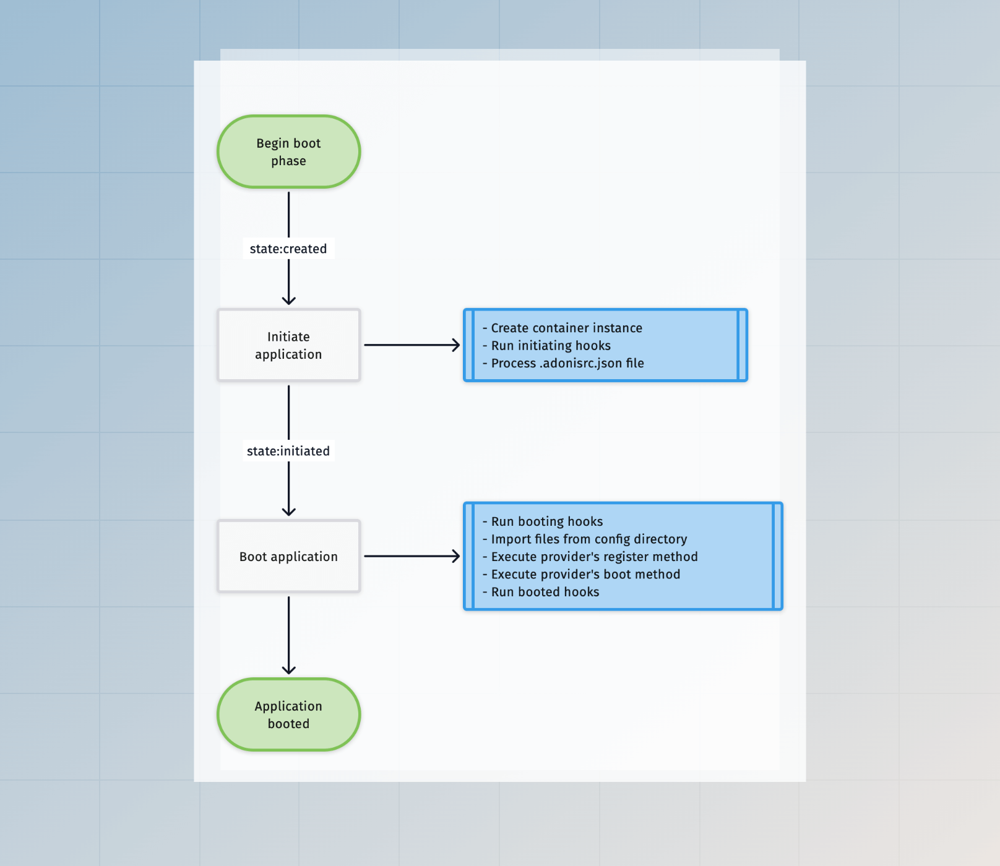
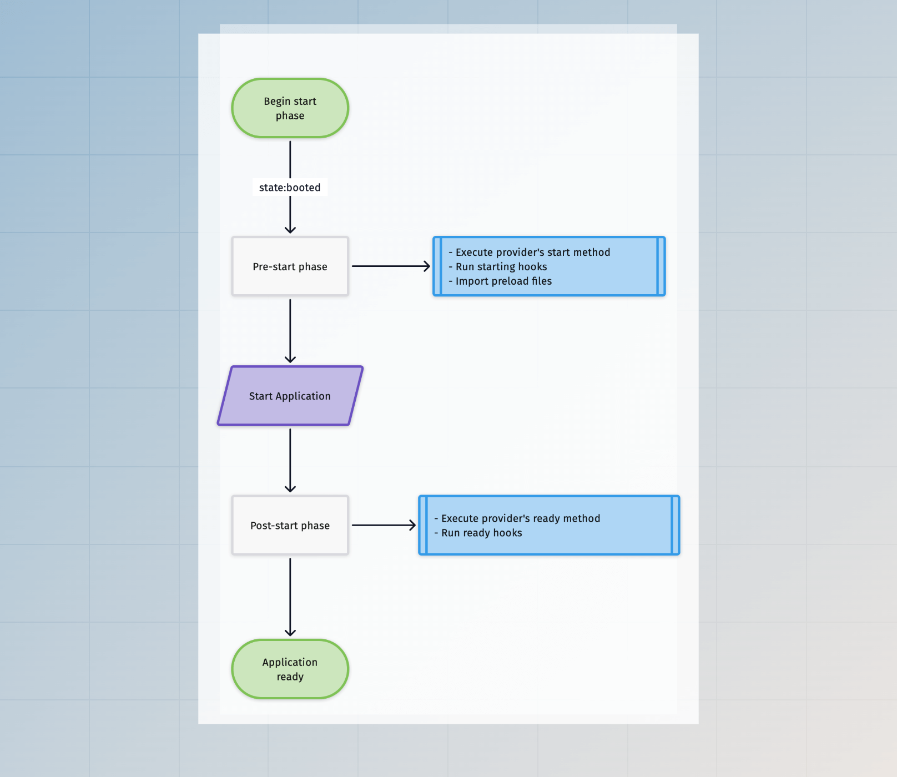

# Application lifecycle

In this guide, we will learn how AdonisJS boots your application and what lifecycle hooks you can use to change the application state before it is considered ready.

The lifecycle of an application depends upon the environment in which it is running. For example, a long-lived process started to serve HTTP requests is managed differently from a short-lived ace command.

So, let's understand the application lifecycle for every supported environment.

## How an AdonisJS application gets started
An AdonisJS application has multiple entry points, and each entry point boots the application in a specific environment. The following entrypoint files are stored inside the `bin` directory.

- The `bin/server.ts` entry point boots the AdonisJS application to handle HTTP requests. When you run the `node ace serve` command, behind the scenes we run this file as a child process.
- The `bin/console.ts` entry point boots the AdonisJS application to handle CLI commands. This file uses [Ace](../ace/introduction.md) under the hood.
- The `bin/test.ts` entrypoint boots the AdonisJS application to run tests using Japa.

If you open any of these files, you will find us using the [Ignitor](https://github.com/adonisjs/core/blob/main/src/ignitor/main.ts#L23) module to wire things up and then start the application.

The Ignitor module encapsulates the logic of starting an AdonisJS application. Under the hood, it performs the following actions.

- Create an instance of the [Application](https://github.com/adonisjs/application/blob/main/src/application.ts) class.
- Initiate/boot the application.
- Perform the main action to start the application. For example, in the case of an HTTP server, the `main` action involves starting the HTTP server. Whereas, in the case of tests, the `main` action involves running the tests.

The [Ignitor codebase](https://github.com/adonisjs/core/tree/main/src/ignitor) is relatively straightforward, so browse the source code to understand it better.

## The boot phase

The boot phase remains the same for all the environments except the `console` environment. In the `console` environment, the executed command decides whether to boot the application.

You can only use the container bindings and services once the application is booted.



## The start phase

The start phase varies between all the environments. Also, the execution flow is further divided into the following sub-phases

- The `pre-start` phase refers to the actions performed before starting the app. 

- The `post-start` phase refers to the actions performed after starting the app. In the case of an HTTP server, the actions will be executed after the HTTP server is ready to accept new connections.



### During the web environment

In the web environment, a long-lived HTTP connection is created to listen for incoming requests, and the application stays in the `ready` state until the server crashes or the process receives a signal to shut down.

### During the test environment

The **pre-start** and the **post-start** actions are executed in the test environment. After that, we import the test files and execute the tests.

### During the console environment

In the `console` environment, the executed command decides whether to start the application.

A command can start the application by enabling the `options.startApp` flag. As a result, the **pre-start** and the **post-start** actions will run before the command's `run` method.

```ts
import { BaseCommand } from '@adonisjs/core/ace'

export default class GreetCommand extends BaseCommand {
  static options = {
    startApp: true
  }
  
  async run() {
    console.log(this.app.isReady) // true
  }
}
```

## The termination phase

The termination of the application varies greatly between short-lived and long-lived processes. 

A short-lived command or the test process begins the termination after the main operation ends.

A long-lived HTTP server process waits for exit signals like `SIGTERM` to begin the termination process.


### Responding to process signals

In all the environments, we begin a graceful shutdown process when the application receives a `SIGTERM` signal. If you have started your application using [pm2](https://pm2.keymetrics.io/docs/usage/signals-clean-restart/), the graceful shutdown will happen after receiving the `SIGINT` event.

### During the web environment

In the web environment, the application keeps running until the underlying HTTP server crashes with an error. In that case, we begin terminating the app.

### During the test environment

The graceful termination begins after all the tests have been executed.

### During the console environment

In the `console` environment, the termination of the app depends on the executed command.

The app will terminate as soon as the command is executed unless the `options.staysAlive` flag is enabled, and in this case, the command should explicitly terminate the app.

```ts
import { BaseCommand } from '@adonisjs/core/ace'

export default class GreetCommand extends BaseCommand {
  static options = {
    startApp: true,
    staysAlive: true,
  }
  
  async run() {
    await runSomeProcess()
    
    // Terminate the process
    await this.terminate()
  }
}
```

## Lifecycle hooks

Lifecycle hooks allow you to hook into the application bootstrap process and perform actions as the app goes through different states.

You can listen for hooks using the service provider classes or define them inline on the application class.

### Inline callbacks

You should register lifecycle hooks as soon as an application instance is created. 

The entry point files `bin/server.ts`, `bin/console.ts`, and `bin/test.ts` creates a fresh application instance for different environments, and you can register inline callbacks within these files.

```ts
const app = new Application(new URL('../', import.meta.url))

new Ignitor(APP_ROOT, { importer: IMPORTER })
  .tap((app) => {
    // highlight-start
    app.booted(() => {
      console.log('invoked after the app is booted')
    })
    
    app.ready(() => {
      console.log('invoked after the app is ready')
    })
    
    app.terminating(() => {
      console.log('invoked before the termination starts')
    })
    // highlight-end
  })
```

- `initiating`: The hook actions are called before the application moves to the initiated state. The `adonisrc.ts` file is parsed after executing the `initiating` hooks.

- `booting`: The hook actions are called before booting the app. The config files are imported after executing `booting` hooks.

- `booted`: The hook actions are invoked after all the service providers have been registered and booted.

- `starting`: The hook actions are invoked before importing the preload files.

- `ready`: The hook actions are invoked after the application is ready.

- `terminating`: The hook actions are invoked once the graceful exit process begins. For example, this hook can close database connections or end open streams.

### Using service providers

Services providers define the lifecycle hooks as methods in the provider class. We recommend using service providers over inline callbacks, as they keep everything neatly organized.

Following is the list of available lifecycle methods.

```ts
import { ApplicationService } from '@adonisjs/core/types'

export default class AppProvider {
  constructor(protected app: ApplicationService) {}
  
  register() {
  }
  
  async boot() {
  }
  
  async start() {
  }
  
  async ready() {
  }
  
  async shutdown() {
  }
}
```

- `register`: The register method registers bindings within the container. This method is synchronous by design.

- `boot`: The boot method is used to boot or initialize the bindings you have registered inside the container.

- `start`: The start method runs just before the `ready` method. It allows you to perform actions that the `ready` hook actions might need.

- `ready`: The ready method runs after the application is considered ready.

- `shutdown`: The shutdown method is invoked when the application begins the graceful shutdown. You can use this method to close database connections, or end opened streams.
