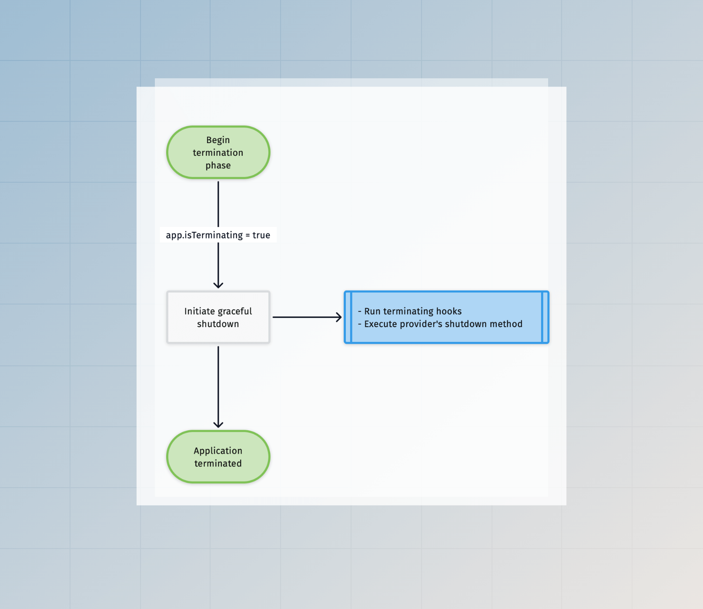

# Ciclo de vida do aplicativo

Neste guia, aprenderemos como o AdonisJS inicializa seu aplicativo e quais ganchos de ciclo de vida você pode usar para alterar o estado do aplicativo antes que ele seja considerado pronto.

O ciclo de vida de um aplicativo depende do ambiente em que ele está sendo executado. Por exemplo, um processo de longa duração iniciado para atender a solicitações HTTP é gerenciado de forma diferente de um comando ace de curta duração.

Então, vamos entender o ciclo de vida do aplicativo para cada ambiente suportado.

## Como um aplicativo AdonisJS é iniciado
Um aplicativo AdonisJS tem vários pontos de entrada, e cada ponto de entrada inicializa o aplicativo em um ambiente específico. Os seguintes arquivos de ponto de entrada são armazenados dentro do diretório `bin`.

- O ponto de entrada `bin/server.ts` inicializa o aplicativo AdonisJS para manipular solicitações HTTP. Quando você executa o comando `node ace serve`, nos bastidores, executamos esse arquivo como um processo filho.
[Ace](../ace/introduction.md) nos bastidores.
- O ponto de entrada `bin/test.ts` inicializa o aplicativo AdonisJS para executar testes usando Japa.

Se você abrir qualquer um desses arquivos, nos verá usando o módulo [Ignitor](https://github.com/adonisjs/core/blob/main/src/ignitor/main.ts#L23) para conectar as coisas e, em seguida, iniciar o aplicativo.

O módulo Ignitor encapsula a lógica de iniciar um aplicativo AdonisJS. Nos bastidores, ele executa as seguintes ações.

Classe [Application](https://github.com/adonisjs/application/blob/main/src/application.ts).
- Iniciar/inicializar o aplicativo.
- Executar a ação principal para iniciar o aplicativo. Por exemplo, no caso de um servidor HTTP, a ação `main` envolve iniciar o servidor HTTP. Enquanto isso, no caso de testes, a ação `main` envolve executar os testes.

A [base de código do Ignitor](https://github.com/adonisjs/core/tree/main/src/ignitor) é relativamente simples, então navegue pelo código-fonte para entendê-lo melhor.

## A fase de inicialização

A fase de inicialização permanece a mesma para todos os ambientes, exceto o ambiente `console`. No ambiente `console`, o comando executado decide se deve inicializar o aplicativo.

Você só pode usar as ligações e serviços do contêiner depois que o aplicativo for inicializado.


## A fase de inicialização

A fase de inicialização varia entre todos os ambientes. Além disso, o fluxo de execução é dividido nas seguintes subfases

- A fase `pré-inicialização` se refere às ações realizadas antes de iniciar o aplicativo.

- A fase `post-start` se refere às ações realizadas após iniciar o aplicativo. No caso de um servidor HTTP, as ações serão executadas após o servidor HTTP estar pronto para aceitar novas conexões.


### Durante o ambiente da web

No ambiente da web, uma conexão HTTP de longa duração é criada para escutar solicitações de entrada, e o aplicativo permanece no estado `ready` até que o servidor falhe ou o processo receba um sinal para desligar.

### Durante o ambiente de teste

As ações **pre-start** e **post-start** são executadas no ambiente de teste. Depois disso, importamos os arquivos de teste e executamos os testes.

### Durante o ambiente do console

No ambiente `console`, o comando executado decide se deve iniciar o aplicativo.

Um comando pode iniciar o aplicativo habilitando o sinalizador `options.startApp`. Como resultado, as ações **pré-início** e **pós-início** serão executadas antes do método `run` do comando.

```ts
import { BaseCommand } from '@adonisjs/core/ace'

export default class GreetCommand extends BaseCommand {
  static options = {
    startApp: true
  }
  
  async run() {
    console.log(this.app.isReady) // true
  }
}
```

## A fase de encerramento

O encerramento do aplicativo varia muito entre processos de curta e longa duração.

Um comando de curta duração ou o processo de teste inicia o encerramento após o término da operação principal.

Um processo de servidor HTTP de longa duração aguarda sinais de saída como `SIGTERM` para iniciar o processo de encerramento.



### Respondendo a sinais de processo

Em todos os ambientes, iniciamos um processo de encerramento normal quando o aplicativo recebe um sinal `SIGTERM`. Se você iniciou seu aplicativo usando [pm2](https://pm2.keymetrics.io/docs/usage/signals-clean-restart/), o encerramento normal ocorrerá após receber o evento `SIGINT`.

### Durante o ambiente da web

No ambiente da web, o aplicativo continua em execução até que o servidor HTTP subjacente trave com um erro. Nesse caso, iniciamos o encerramento do aplicativo.

### Durante o ambiente de teste

O encerramento normal começa depois que todos os testes foram executados.

### Durante o ambiente de console

No ambiente `console`, o encerramento do aplicativo depende do comando executado.

O aplicativo será encerrado assim que o comando for executado, a menos que o sinalizador `options.staysAlive` esteja habilitado e, neste caso, o comando deve encerrar explicitamente o aplicativo.

```ts
import { BaseCommand } from '@adonisjs/core/ace'

export default class GreetCommand extends BaseCommand {
  static options = {
    startApp: true,
    staysAlive: true,
  }
  
  async run() {
    await runSomeProcess()
    
    // Terminate the process
    await this.terminate()
  }
}
```

## Ganchos do ciclo de vida

Os ganchos do ciclo de vida permitem que você se conecte ao processo de bootstrap do aplicativo e execute ações conforme o aplicativo passa por diferentes estados.

Você pode ouvir ganchos usando as classes do provedor de serviços ou defini-los em linha na classe do aplicativo.

### Retornos de chamada em linha

Você deve registrar ganchos do ciclo de vida assim que uma instância do aplicativo for criada.

Os arquivos de ponto de entrada `bin/server.ts`, `bin/console.ts` e `bin/test.ts` criam uma nova instância de aplicativo para diferentes ambientes, e você pode registrar retornos de chamada em linha nesses arquivos.

```ts
const app = new Application(new URL('../', import.meta.url))

new Ignitor(APP_ROOT, { importer: IMPORTER })
  .tap((app) => {
    // highlight-start
    app.booted(() => {
      console.log('invoked after the app is booted')
    })
    
    app.ready(() => {
      console.log('invoked after the app is ready')
    })
    
    app.terminating(() => {
      console.log('invoked before the termination starts')
    })
    // highlight-end
  })
```

- `initiating`: As ações de hook são chamadas antes que o aplicativo passe para o estado iniciado. O arquivo `adonisrc.ts` é analisado após a execução dos hooks `initiating`.

- `booting`: As ações de hook são chamadas antes da inicialização do aplicativo. Os arquivos de configuração são importados após a execução dos hooks `booting`.

- `booted`: As ações de hook são invocadas após todos os provedores de serviço terem sido registrados e inicializados.

- `starting`: As ações de hook são invocadas antes da importação dos arquivos de pré-carregamento.

- `ready`: As ações de hook são invocadas após o aplicativo estar pronto.

- `terminating`: As ações de hook são invocadas quando o processo de saída normal começa. Por exemplo, este hook pode fechar conexões de banco de dados ou encerrar fluxos abertos.

### Usando provedores de serviço

Os provedores de serviço definem os hooks do ciclo de vida como métodos na classe do provedor. Recomendamos usar provedores de serviço em vez de retornos de chamada em linha, pois eles mantêm tudo bem organizado.

A seguir está a lista de métodos de ciclo de vida disponíveis.

```ts
import { ApplicationService } from '@adonisjs/core/types'

export default class AppProvider {
  constructor(protected app: ApplicationService) {}
  
  register() {
  }
  
  async boot() {
  }
  
  async start() {
  }
  
  async ready() {
  }
  
  async shutdown() {
  }
}
```

- `register`: O método register registra ligações dentro do contêiner. Este método é síncrono por design.

- `boot`: O método boot é usado para inicializar ou inicializar as ligações que você registrou dentro do contêiner.

- `start`: O método start é executado logo antes do método `ready`. Ele permite que você execute ações que as ações do hook `ready` podem precisar.

- `ready`: O método ready é executado após o aplicativo ser considerado pronto.

- `shutdown`: O método shutdown é invocado quando o aplicativo inicia o desligamento normal. Você pode usar esse método para fechar conexões de banco de dados ou encerrar fluxos abertos.
