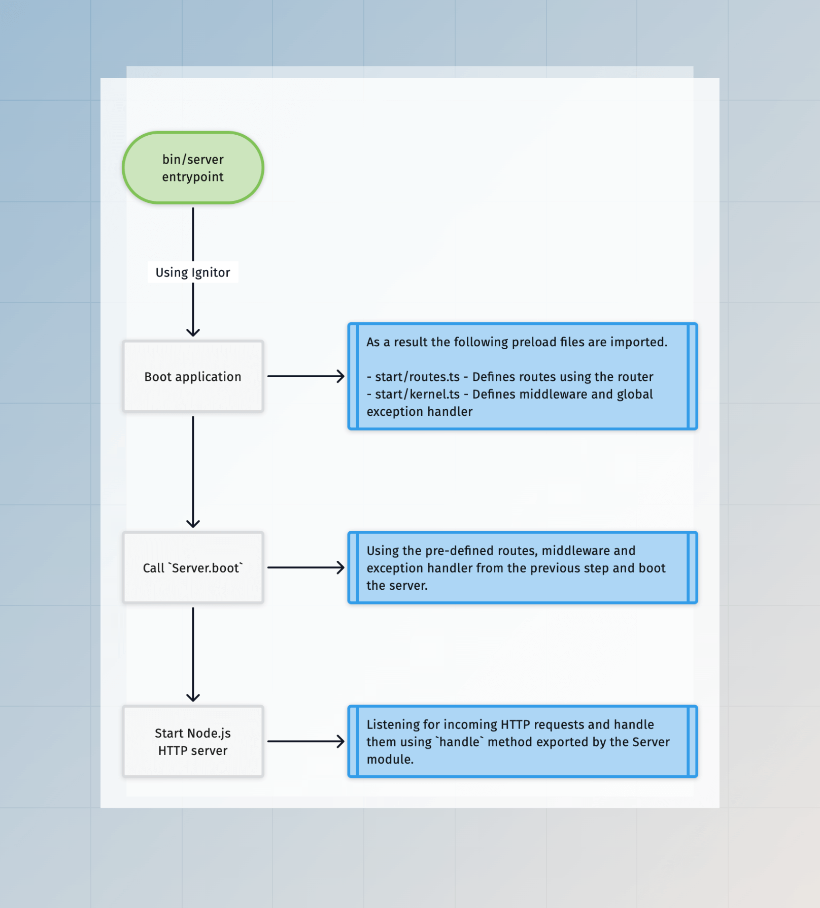

# Visão geral do HTTP

O AdonisJS é principalmente uma estrutura da web para criar aplicativos que respondem a solicitações HTTP. Neste guia, aprenderemos como o AdonisJS inicializa o servidor HTTP, manipula as solicitações de entrada e os módulos disponíveis na camada HTTP.

## A camada HTTP
A camada HTTP dentro de um aplicativo AdonisJS consiste nos seguintes módulos. Vale mencionar que a camada HTTP do AdonisJS é construída do zero e não usa nenhum microframework sob o capô.

### [Roteador](../basics/routing.md)

O [módulo roteador](https://github.com/adonisjs/http-server/blob/main/src/router/main.ts) é responsável por definir os pontos de extremidade do seu aplicativo, que são conhecidos como rotas. Uma rota deve definir um manipulador responsável por manipular a solicitação. O manipulador pode ser um fechamento ou referência a um controlador.

### [Controladores](../basics/controllers.md)

Controladores são classes JavaScript que você vincula a uma rota para manipular as solicitações HTTP. Controladores agem como uma camada de organização e ajudam a dividir a lógica de negócios do seu aplicativo dentro de diferentes arquivos/classes.

### [HttpContext](./http_context.md)

O AdonisJS cria uma instância da classe [HttpContext](https://github.com/adonisjs/http-server/blob/main/src/http_context/main.ts) para cada solicitação HTTP recebida. O HttpContext (também conhecido como `ctx`) carrega informações como o corpo da solicitação, cabeçalhos, usuário autenticado, etc., para uma determinada solicitação.

### [Middleware](../basics/middleware.md)

O pipeline de middleware no AdonisJS é uma implementação do padrão de design [Chain of Responsibility](https://refactoring.guru/design-patterns/chain-of-responsibility). Você pode usar o middleware para interceptar solicitações HTTP e responder a elas antes que cheguem ao manipulador de rotas.

### [Global Exception handler](../basics/exception_handling.md)

O manipulador de exceção global manipula exceções geradas durante uma solicitação HTTP em um local central. Você pode usar o manipulador de exceção global para converter exceções em uma resposta HTTP ou relatá-las a um serviço de registro externo.

### Servidor

O [módulo do servidor](https://github.com/adonisjs/http-server/blob/main/src/server/main.ts) conecta o roteador, o middleware, o manipulador de exceção global e exporta [uma função `handle`](https://github.com/adonisjs/http-server/blob/main/src/server/main.ts#L330) que você pode vincular ao servidor HTTP do Node.js para manipular solicitações.

## Como o AdonisJS inicializa o servidor HTTP
O servidor HTTP é inicializado quando você chama [o método `boot`](https://github.com/adonisjs/http-server/blob/main/src/server/main.ts#L252) na classe Server. Por baixo dos panos, esse método executa as seguintes ações.

- Crie o pipeline de middleware
- Compile rotas
- Importe e instancie o manipulador de exceção global

Em um aplicativo AdonisJS típico, o método `boot` é chamado pelo módulo [Ignitor](https://github.com/adonisjs/core/blob/main/src/ignitor/http.ts) dentro do arquivo `bin/server.ts`.

Além disso, é essencial definir as rotas, o middleware e o manipulador de exceção global antes que o método `boot` seja chamado, e o AdonisJS consegue isso usando os arquivos de pré-carregamento `start/routes.ts` e `start/kernel.ts`](./adonisrc_file.md#preloads).

## Ciclo de vida da solicitação HTTP
Agora que temos um servidor HTTP escutando solicitações de entrada. Vamos ver como o AdonisJS lida com uma determinada solicitação HTTP.

::: info **Veja também:**

* [Fluxo de execução do middleware](../basics/middleware.md#middleware-execution-flow)
* [Middleware e tratamento de exceções](../basics/middleware.md#middleware-and-exception-handling)
:::

### Criando o `HttpContext`

Como primeira etapa, o módulo do servidor cria uma instância da classe [HttpContext](./http_context.md) e a passa como uma referência ao middleware, aos manipuladores de rota e ao manipulador de exceção global.

Se você habilitou o [AsyncLocalStorage](./async_local_storage.md#usage), a mesma instância é
compartilhada como o estado de armazenamento local.

### Executando pilha de middleware do servidor

Em seguida, o middleware da [pilha de middleware do servidor](../basics/middleware.md#server-middleware-stack) é executado. Esses middlewares podem interceptar e responder à solicitação antes que ela alcance o manipulador de rotas.

Além disso, cada solicitação HTTP passa pela pilha de middleware do servidor, mesmo que você não tenha definido nenhum roteador para o ponto de extremidade fornecido. Isso permite que o middleware do servidor adicione funcionalidade a um aplicativo sem depender do sistema de roteamento.

### Encontrando a rota correspondente

Se um middleware do servidor não encerrar a solicitação, procuramos uma rota correspondente para a propriedade `req.url`. A solicitação é abortada com uma exceção `404 - Não encontrado` quando nenhuma rota correspondente existe. Caso contrário, continuamos com a solicitação.

### Executando o middleware de rota

Assim que houver uma rota correspondente, executamos o [middleware global do roteador](../basics/middleware.md#router-middleware-stack) e a [pilha de middleware nomeada](../basics/middleware.md#named-middleware-collection). Novamente, o middleware pode interceptar a solicitação antes que ela chegue ao manipulador de rota.

### Executando o manipulador de rota

Como etapa final, a solicitação chega ao manipulador de rota e retorna ao cliente com uma resposta.

Suponha que uma exceção seja gerada durante qualquer etapa do processo. Nesse caso, a solicitação será entregue ao manipulador de exceção global, que é responsável por converter a exceção em uma resposta.

### Serializando a resposta

Depois de definir o corpo da resposta usando o método `response.send` ou retornando um valor do manipulador de rota, iniciamos o processo de serialização da resposta e definimos os cabeçalhos apropriados.

Saiba mais sobre [serialização do corpo de resposta](../basics/response.md#response-body-serialization)
