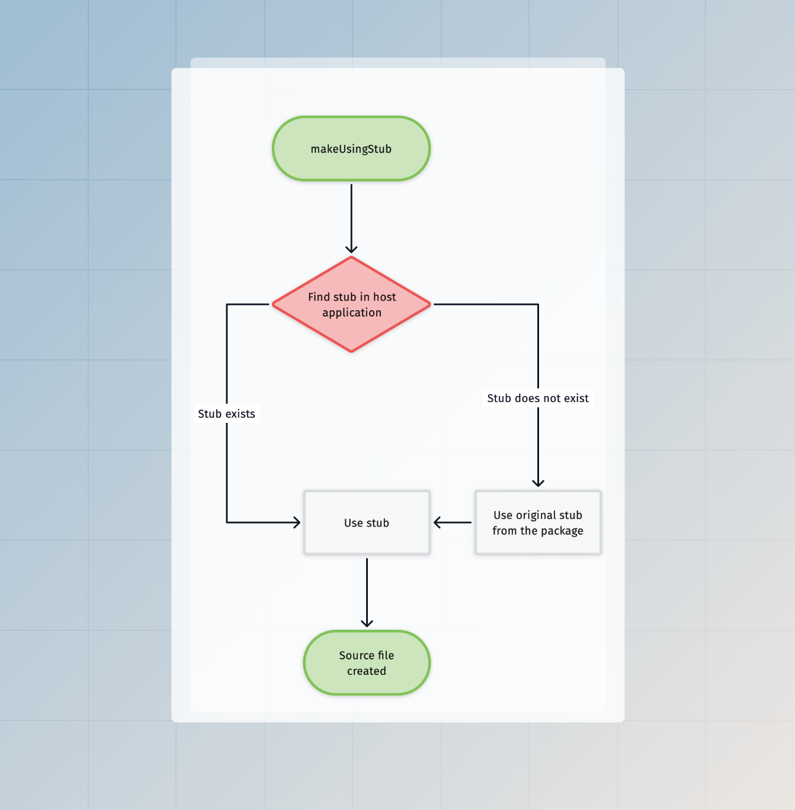

# Scaffolding and codemods

Scaffolding refers to the process of generating source files from static templates (aka stubs), and codemods refer to updating the TypeScript source code by parsing the AST.

AdonisJS uses both to speed up the repetitive tasks of creating new files and configuring packages. In this guide, we will go through the building blocks of Scaffolding and cover the codemods API you can use within Ace commands.

## Building blocks

### Stubs
Stubs refers to the templates, that are used to create source files on a given action. For example, The `make:controller` command uses the [controller stub](https://github.com/adonisjs/core/blob/main/stubs/make/controller/main.stub) to create a controller file inside the host project.

### Generators
Generators enforce a naming convention and generate file, class, or method names based on the pre-defined conventions.

For example, the controller stubs use the [controllerName](https://github.com/adonisjs/application/blob/main/src/generators.ts#L122) and [controllerFileName](https://github.com/adonisjs/application/blob/main/src/generators.ts#L139) generators to create a controller. 

Since generators are defined as an object, you can override the existing methods to tweak the conventions. We learn more about that later in this guide.

### Codemods
The codemods API comes from the [@adonisjs/assembler](https://github.com/adonisjs/assembler/blob/main/src/code_transformer/main.ts) package, and it uses [ts-morph](https://github.com/dsherret/ts-morph) under the hood.

Since `@adonisjs/assembler` is a development dependency, `ts-morph` does not bloat your project dependencies in production. Also, it means, the codemods APIs are not available in production.

The codemods API exposed by AdonisJS are very specific to accomplish high-level tasks like **add a provider to the `.adonisrc.ts` file**, or **register a middleware inside the `start/kernel.ts`** file. Also, these APIs rely on the default naming conventions, so if you make drastic changes to your project, you will not be able to run codemods.

### Configure command
The configure command is used to configure an AdonisJS package. Under the hood, this command imports the main entry point file and executes the `configure` method exported by the mentioned package.

The package's `configure` method receives an instance of the [Configure command](https://github.com/adonisjs/core/blob/main/commands/configure.ts), and therefore, it can access the stubs and codemods API from the command instance directly.

## Using stubs
Most of the time, you will use stubs within an Ace command or inside the `configure` method of a package you have created. You can initialize the codemods module in both cases via the Ace command's `createCodemods` method. 

The `codemods.makeUsingStub` method creates a source file from a stub template. It accepts the following arguments:

- The URL to the root of the directory where stubs are stored.
- Relative path from the `STUBS_ROOT` directory to the stub file (including extension).
- And the data object to share with the stub.

```ts
// title: Inside a command
import { BaseCommand } from '@adonisjs/core/ace'

const STUBS_ROOT = new URL('./stubs', import.meta.url)

export default class MakeApiResource extends BaseCommand {
  async run() {
    // highlight-start
    const codemods = await this.createCodemods()
    await codemods.makeUsingStub(STUBS_ROOT, 'api_resource.stub', {})
    // highlight-end
  }
}
```

### Stubs templating
We use [Tempura](https://github.com/lukeed/tempura) template engine to process the stubs with runtime data. Tempura is a super lightweight handlebars-style template engine for JavaScript.

:::tip

Since Tempura's syntax is compatible with handlebars, you can set your code editors to use handlebar syntax highlighting with `.stub` files.

:::

In the following example, we create a stub that outputs a JavaScript class. It uses the double curly braces to evaluate runtime values.

```handlebars
export default class {{ modelName }}Resource {
  serialize({{ modelReference }}: {{ modelName }}) {
    return {{ modelReference }}.toJSON()
  }
}
```

### Using generators

If you execute the above stub right now, it will fail because we have not provided the `modelName` and `modelReference` data properties.

We recommend computing these properties within the stub using inline variables. This way, the host application can [eject the stub](#ejecting-stubs) and modify the variables.

```js
// insert-start
{{#var entity = generators.createEntity('user')}}
{{#var modelName = generators.modelName(entity.name)}}
{{#var modelReference = string.toCamelCase(modelName)}}
// insert-end

export default class {{ modelName }}Resource {
  serialize({{ modelReference }}: {{ modelName }}) {
    return {{ modelReference }}.toJSON()
  }
}
```

### Output destination
Finally, we have to specify the destination path of the file that will be created using the stub. Once again, we specify the destination path within the stub file, as it allows the host application to [eject the stub](#ejecting-stubs) and customize its output destination.

The destination path is defined using the `exports` function. The function accepts an object and exports it as the output state of the stub. Later, the codemods API uses this object to create the file at the mentioned location.

```js
{{#var entity = generators.createEntity('user')}}
{{#var modelName = generators.modelName(entity.name)}}
{{#var modelReference = string.toCamelCase(modelName)}}
// insert-start
{{#var resourceFileName = string(modelName).snakeCase().suffix('_resource').ext('.ts').toString()}}
{{{
  exports({
    to: app.makePath('app/api_resources', entity.path, resourceFileName)
  })
}}}
// insert-end
export default class {{ modelName }}Resource {
  serialize({{ modelReference }}: {{ modelName }}) {
    return {{ modelReference }}.toJSON()
  }
}
```

### Accepting entity name via command
Right now, we have hardcoded the entity name as `user` within the stub. However, you should accept it as a command argument and share it with the stub as the template state.

```ts
import { BaseCommand, args } from '@adonisjs/core/ace'

export default class MakeApiResource extends BaseCommand {
  // insert-start
  @args.string({
    description: 'The name of the resource'
  })
  declare name: string
  // insert-end

  async run() {
    const codemods = await this.createCodemods()
    await codemods.makeUsingStub(STUBS_ROOT, 'api_resource.stub', {
      // insert-start
      name: this.name,
      // insert-end
    })
  }
}
```

```js
// delete-start
{{#var entity = generators.createEntity('user')}}
// delete-end
// insert-start
{{#var entity = generators.createEntity(name)}}
// insert-end
{{#var modelName = generators.modelName(entity.name)}}
{{#var modelReference = string.toCamelCase(modelName)}}
{{#var resourceFileName = string(modelName).snakeCase().suffix('_resource').ext('.ts').toString()}}
{{{
  exports({
    to: app.makePath('app/api_resources', entity.path, resourceFileName)
  })
}}}
export default class {{ modelName }}Resource {
  serialize({{ modelReference }}: {{ modelName }}) {
    return {{ modelReference }}.toJSON()
  }
}
```

### Global variables
The following global variables are always shared with a stub.

| Variable       | Description                                                                                                                                                         |
|----------------|---------------------------------------------------------------------------------------------------------------------------------------------------------------------|
| `app`          | Reference to an instance of the [application class](./application.md).                                                                                                |
| `generators`   | Reference to the [generators module](https://github.com/adonisjs/application/blob/main/src/generators.ts).                                                          |
| `randomString` | Reference to the [randomString](../references/helpers.md#random) helper function.                                                                               |
| `string`       | A function to create a [string builder](../references/helpers.md#string-builder) instance. You can use the string builder to apply transformations on a string. |
| `flags`        | The command-line flags are defined when running the ace command.                                                                                                    |


## Ejecting stubs
You can eject/copy stubs inside an AdonisJS application using the `node ace eject` command. The eject command accepts a path to the original stub file or its parent directory and copies the templates inside the `stubs` directory of your project's root.

In the following example, we will copy the `make/controller/main.stub` file from the `@adonisjs/core` package.

```sh
node ace eject make/controller/main.stub
```

If you open the stub file, it will have the following contents.

```js
{{#var controllerName = generators.controllerName(entity.name)}}
{{#var controllerFileName = generators.controllerFileName(entity.name)}}
{{{
  exports({
    to: app.httpControllersPath(entity.path, controllerFileName)
  })
}}}
// import type { HttpContext } from '@adonisjs/core/http'

export default class {{ controllerName }} {
}
```

- In the first two lines, we use the [generators module](https://github.com/adonisjs/application/blob/main/src/generators.ts) to generate the controller class name and the controller file name.
- From lines 3-7, we [define the destination path](#using-cli-flags-to-customize-stub-output-destination)customizing-the-destination-path) for the controller file using the `exports` function.
- Finally, we define the contents of the scaffolded controller.

Feel free to modify the stub. Next time, the changes will be picked when you run the `make:controller` command.

### Ejecting directories

You may eject an entire directory of stubs using the `eject` command. Pass the path to the directory, and the command will copy the whole directory.

```sh
# Publish all the make stubs
node ace eject make

# Publish all the make:controller stubs
node ace eject make/controller
```

### Using CLI flags to customize stub output destination
All scaffolding commands share the CLI flags (including unsupported ones) with the stub templates. Therefore, you can use them to create custom workflows or change the output destination.

In the following example, we use the `--feature` flag to create a controller inside the mentioned features directory.

```sh
node ace make:controller invoice --feature=billing
```

```js
// title: Controller stub
{{#var controllerName = generators.controllerName(entity.name)}}
// insert-start
{{#var featureDirectoryName = generators.makePath('features', flags.feature)}}
// insert-end
{{#var controllerFileName = generators.controllerFileName(entity.name)}}
{{{
  exports({
    // delete-start
    to: app.httpControllersPath(entity.path, controllerFileName)
    // delete-end
    // insert-start
    to: app.makePath(featureDirectoryName, entity.path, controllerFileName)
    // insert-end
  })
}}}
// import type { HttpContext } from '@adonisjs/core/http'

export default class {{ controllerName }} {
}
```

### Ejecting stubs from other packages

By default, the `eject` command copies templates from the `@adonisjs/core` package. However, you may copy stubs from other packages using the `--pkg` flag.

```sh
node ace eject make/migration/main.stub --pkg=@adonisjs/lucid
```

### How do you find which stubs to copy?
You can find a package's stubs by visiting its GitHub repo. We store all the stubs at the root level of the package inside the `stubs` directory.

## Stubs execution flow
Here's a visual representation of how we find and execute stubs via the `makeUsingStub` method.



## Codemods API
The codemods API is powered by [ts-morph](https://github.com/dsherret/ts-morph) and is only available during development. You can lazily instantiate the codemods module using the `command.createCodemods` method. The `createCodemods` method returns an instance of the [Codemods](https://github.com/adonisjs/core/blob/main/modules/ace/codemods.ts) class.

```ts
import type Configure from '@adonisjs/core/commands/configure'

export async function configure(command: ConfigureCommand) {
  const codemods = await command.createCodemods()
}
```

### defineEnvValidations
Define validation rules for environment variables. The method accepts a key-value pair of variables. The `key` is the env variable name, and the `value` is the validation expression as a string.

:::note
This codemod expects the `start/env.ts` file to exist and must have the `export default await Env.create` method call.

Also, the codemod does not overwrite the existing validation rule for a given environment variable. This is done to respect in-app modifications.
:::

```ts
const codemods = await command.createCodemods()

try {
  await codemods.defineEnvValidations({
    leadingComment: 'App environment variables',
    variables: {
      PORT: 'Env.schema.number()',
      HOST: 'Env.schema.string()',
    }
  })
} catch (error) {
  console.error('Unable to define env validations')
  console.error(error)
}
```

```ts
// title: Output
import { Env } from '@adonisjs/core/env'

export default await Env.create(new URL('../', import.meta.url), {
  /**
   * App environment variables
   */
  PORT: Env.schema.number(),
  HOST: Env.schema.string(),
})
```

### defineEnvVariables
Add one or multiple new environment variables to the `.env` and `.env.example` files. The method accepts a key-value pair of variables.

```ts
const codemods = await command.createCodemods()

try {
  await codemods.defineEnvVariables({
    MY_NEW_VARIABLE: 'some-value',
    MY_OTHER_VARIABLE: 'other-value'
  })
} catch (error) {
  console.error('Unable to define env variables')
  console.error(error)
}
```

Sometimes you may want to **not** insert the variable value in the `.env.example` file. You can do so by using the `omitFromExample` option.

```ts
const codemods = await command.createCodemods()

await codemods.defineEnvVariables({
  MY_NEW_VARIABLE: 'SOME_VALUE',
}, {
  omitFromExample: ['MY_NEW_VARIABLE']
})
```

The above code will insert `MY_NEW_VARIABLE=SOME_VALUE` in the `.env` file and `MY_NEW_VARIABLE=` in the `.env.example` file.

### registerMiddleware
Register AdonisJS middleware to one of the known middleware stacks. The method accepts the middleware stack and an array of middleware to register.

The middleware stack could be one of `server | router | named`.

:::note
This codemod expects the `start/kernel.ts` file to exist and must have a function call for the middleware stack for which you are trying to register a middleware.
:::

```ts
const codemods = await command.createCodemods()

try {
  await codemods.registerMiddleware('router', [
    {
      path: '@adonisjs/core/bodyparser_middleware'
    }
  ])
} catch (error) {
  console.error('Unable to register middleware')
  console.error(error)
}
```

```ts
// title: Output
import router from '@adonisjs/core/services/router'

router.use([
  () => import('@adonisjs/core/bodyparser_middleware')
])
```

You may define named middleware as follows.

```ts
const codemods = await command.createCodemods()

try {
  await codemods.registerMiddleware('named', [
    {
      name: 'auth',
      path: '@adonisjs/auth/auth_middleware'
    }
  ])
} catch (error) {
  console.error('Unable to register middleware')
  console.error(error)
}
```

### updateRcFile
Register `providers`, `commands`, define `metaFiles` and `commandAliases` to the `adonisrc.ts` file.

:::note
This codemod expects the `adonisrc.ts` file to exist and must have an `export default defineConfig` function call.
:::

```ts
const codemods = await command.createCodemods()

try {
  await codemods.updateRcFile((rcFile) => {
    rcFile
      .addProvider('@adonisjs/lucid/db_provider')
      .addCommand('@adonisjs/lucid/commands'),
      .setCommandAlias('migrate', 'migration:run')
  })
} catch (error) {
  console.error('Unable to update adonisrc.ts file')
  console.error(error)  
}
```

```ts
// title: Output
import { defineConfig } from '@adonisjs/core/app'

export default defineConfig({
  commands: [
    () => import('@adonisjs/lucid/commands')
  ],
  providers: [
    () => import('@adonisjs/lucid/db_provider')
  ],
  commandAliases: {
    migrate: 'migration:run'
  }
})
```

### registerJapaPlugin
Register a Japa plugin to the `tests/bootstrap.ts` file.

:::note
This codemod expects the `tests/bootstrap.ts` file to exist and must have the `export const plugins: Config['plugins']` export.
:::

```ts
const codemods = await command.createCodemods()

const imports = [
  {
    isNamed: false,
    module: '@adonisjs/core/services/app',
    identifier: 'app'
  },
  {
    isNamed: true,
    module: '@adonisjs/session/plugins/api_client',
    identifier: 'sessionApiClient'
  }
]
const pluginUsage = 'sessionApiClient(app)'

try {
  await codemods.registerJapaPlugin(pluginUsage, imports)
} catch (error) {
  console.error('Unable to register japa plugin')
  console.error(error)
}
```

```ts
// title: Output
import app from '@adonisjs/core/services/app'
import { sessionApiClient } from '@adonisjs/session/plugins/api_client'

export const plugins: Config['plugins'] = [
  sessionApiClient(app)
]
```

### registerPolicies
Register AdonisJS bouncer policies to the list of `policies` object exported from the `app/policies/main.ts` file.

:::note
This codemod expects the `app/policies/main.ts` file to exist and must export a `policies` object from it.
:::

```ts
const codemods = await command.createCodemods()

try {
  await codemods.registerPolicies([
    {
      name: 'PostPolicy',
      path: '#policies/post_policy'
    }
  ])
} catch (error) {
  console.error('Unable to register policy')
  console.error(error)
}
```

```ts
// title: Output
export const policies = {
  PostPolicy: () => import('#policies/post_policy')
}
```

### registerVitePlugin

Register a Vite plugin to the `vite.config.ts` file.

:::note
This codemod expects the `vite.config.ts` file to exist and must have the `export default defineConfig` function call.
:::

```ts
const transformer = new CodeTransformer(appRoot)
const imports = [
  {
    isNamed: false,
    module: '@vitejs/plugin-vue',
    identifier: 'vue'
  },
]
const pluginUsage = 'vue({ jsx: true })'

try {
  await transformer.addVitePlugin(pluginUsage, imports)
} catch (error) {
  console.error('Unable to register vite plugin')
  console.error(error)
}
```

```ts
// title: Output
import { defineConfig } from 'vite'
import vue from '@vitejs/plugin-vue'

export default defineConfig({
  plugins: [
    vue({ jsx: true })
  ]
})
```

### installPackages

Install one or multiple packages using the detected package manager in the user's project.

```ts
const codemods = await command.createCodemods()

try {
  await codemods.installPackages([
    { name: 'vinejs', isDevDependency: false },
    { name: 'edge', isDevDependency: false }
  ])
} catch (error) {
  console.error('Unable to install packages')
  console.error(error)
}
```

### getTsMorphProject

The `getTsMorphProject` method returns an instance of `ts-morph`. This can be useful when you want to perform custom file transformations that are not covered by the Codemods API.

```ts
const project = await codemods.getTsMorphProject()

project.getSourceFileOrThrow('start/routes.ts')
```

Make sure to read the [ts-morph documentation](https://ts-morph.com/) to know more about the available APIs.
