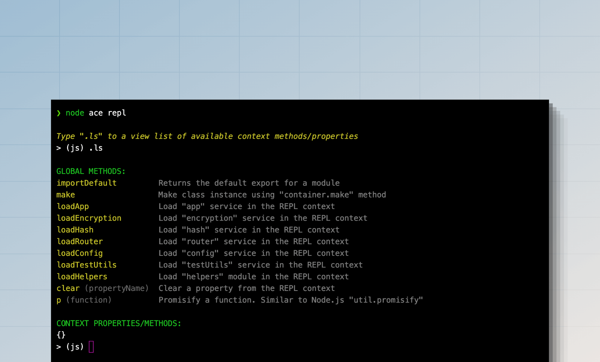

# REPL
Assim como o [Node.js REPL](https://nodejs.org/api/repl.html), AdonisJS oferece um REPL com reconhecimento de aplicativo para interagir com seu aplicativo a partir da linha de comando. Você pode iniciar a sessão REPL usando o comando `node ace repl`.

```sh
node ace repl
```



Além de um REPL Node.js padrão, AdonisJS fornece os seguintes recursos.

- Importar e executar arquivos TypeScript.
- Métodos abreviados para importar serviços de contêiner como o serviço `router`, `helpers`, `hash` e assim por diante.
- [Contêiner IoC](../concepts/dependency_injection.md#constructing-a-tree-of-dependencies).
- API extensível para adicionar métodos personalizados e comandos REPL.

## Interagindo com REPL
Depois de iniciar a sessão REPL, você verá um prompt interativo no qual pode escrever um código JavaScript válido e pressionar Enter para executá-lo. A saída do código será impressa na linha a seguir.

Se quiser digitar várias linhas de código, você pode entrar no modo editor digitando o comando `.editor`. Pressione `Ctrl+D` para executar uma instrução multilinha ou `Ctrl+C` para cancelar e sair do modo editor.

```sh
> (js) .editor
# // Entering editor mode (Ctrl+D to finish, Ctrl+C to cancel)
```

### Acessando o resultado do último comando executado
Se você esquecer de atribuir o valor de uma instrução a uma variável, poderá acessá-la usando a variável `_`. Por exemplo:

```sh
> (js) helpers.string.generateRandom(32)
# 'Z3y8QQ4HFpYSc39O2UiazwPeKYdydZ6M'
> (js) _
# 'Z3y8QQ4HFpYSc39O2UiazwPeKYdydZ6M'
> (js) _.length
# 32
> (js)
```

### Acessando o erro gerado pelo último comando executado
Você pode acessar a exceção gerada pelo comando anterior usando a variável `_error`. Por exemplo:

```sh
> (js) helpers.string.generateRandom()
> (js) _error.message
# 'The value of "size" is out of range. It must be >= 0 && <= 2147483647. Received NaN'
```

### Pesquisando no histórico
O histórico do REPL é salvo no arquivo `.adonisjs_v6_repl_history` no diretório inicial do usuário.

Você pode percorrer os comandos do histórico pressionando a tecla de seta para cima `↑` ou pressionando `Ctrl+R` para pesquisar no histórico.

### Saindo da sessão REPL
Você pode sair da sessão REPL digitando `.exit` ou pressionando `Ctrl+C` duas vezes. O AdonisJS executará um desligamento normal antes de fechar a sessão REPL.

Além disso, se você modificar sua base de código, deverá sair e reiniciar a sessão REPL para que novas alterações sejam aplicadas.

## Importando módulos
O Node.js não permite usar as instruções `import` dentro da sessão REPL. Portanto, você deve usar a função dinâmica `import` e atribuir a saída a uma variável. Por exemplo:

```ts
const { default: User } = await import('#models/user')
```

Você pode usar o método `importDefault` para acessar a exportação padrão sem desestruturar as exportações.

```ts
const User = await importDefault('#models/user')
```

## Métodos auxiliares
Os métodos auxiliares são funções de atalho que você pode executar para realizar ações específicas. Você pode visualizar a lista de métodos disponíveis usando o comando `.ls`.

```sh
> (js) .ls

# GLOBAL METHODS:
importDefault         Returns the default export for a module
make                  Make class instance using "container.make" method
loadApp               Load "app" service in the REPL context
loadEncryption        Load "encryption" service in the REPL context
loadHash              Load "hash" service in the REPL context
loadRouter            Load "router" service in the REPL context
loadConfig            Load "config" service in the REPL context
loadTestUtils         Load "testUtils" service in the REPL context
loadHelpers           Load "helpers" module in the REPL context
clear                 Clear a property from the REPL context
p                     Promisify a function. Similar to Node.js "util.promisify"
```

## Adicionando métodos personalizados ao REPL
Você pode adicionar métodos personalizados ao REPL usando `repl.addMethod`. O método aceita o nome como o primeiro argumento e o retorno de chamada de implementação como o segundo argumento.

Para demonstração, vamos criar um arquivo [preload file](../concepts/adonisrc_file.md#preloads) e definir um método para importar todos os modelos do diretório `./app/models`.

```sh
node ace make:preload repl -e=repl
```

```ts
// title: start/repl.ts
import app from '@adonisjs/core/services/app'
import repl from '@adonisjs/core/services/repl'
import { fsImportAll } from '@adonisjs/core/helpers'

repl.addMethod('loadModels', async () => {
  const models = await fsImportAll(app.makePath('app/models'))
  repl.server!.context.models = models

  repl.notify('Imported models. You can access them using the "models" property')
  repl.server!.displayPrompt()
})
```

Você pode passar as seguintes opções para o método `repl.addMethod` como o terceiro argumento.

- `description`: Descrição legível para exibir na saída de ajuda.
- `usage`: Defina o snippet de código de uso do método. Se não for definido, o nome do método será usado.

Uma vez feito, você pode reiniciar a sessão REPL e executar o método `loadModels` para importar todos os modelos.

```sh
node ace repl

# Type ".ls" to a view list of available context methods/properties
> (js) await loadModels()
```
