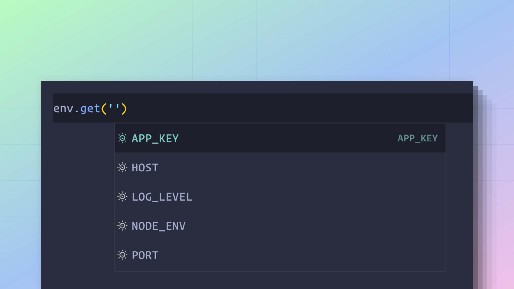

# Environment variables

Environment variables serve the purpose of storing secrets like the database password, the app secret, or an API key outside of your application codebase.

Also, environment variables can be used to have different configurations for different environments. For example, you may use a memory mailer during tests, an SMTP mailer during development, and a third-party service in production.

Since environment variables are supported by all operating systems, deployment platforms, and CI/CD pipelines, they have become a de-facto standard for storing secrets and environment-specific config.

In this guide, we will learn how to leverage environment variables inside an AdonisJS application.

## Reading environment variables

Node.js natively exposes all the environment variables as an object through the [`process.env` global property](https://nodejs.org/dist/latest-v8.x/docs/api/process.html#process_process_env), and you may access them as follows. 

```dotenv
process.env.NODE_ENV
process.env.HOST
process.env.PORT
```

## Using the AdonisJS env module

Reading environment variables via the `process.env` object requires no setup on the AdonisJS side, as the Node.js runtime supports it. However, in the rest of this document, we will use the AdonisJS env module for the following reasons.

- Ability to store and parse environment variables from multiple `.env` files.
- Validate environment variables as soon as the application starts.
- Have static-type safety for validated environment variables.

The env module is instantiated inside the `start/env.ts` file, and you may access it elsewhere inside your application as follows.

```ts
import env from '#start/env'

env.get('NODE_ENV')
env.get('HOST')
env.get('PORT')

// Returns 3333 when PORT is undefined
env.get('PORT', 3333)
```

### Sharing env module with Edge templates
If you want to access environment variables within edge templates, then you must share the `env` module as a global variable with edge templates. 

You can [create `view.ts` as a preload file](../concepts/adonisrc_file.md#preloads) inside the `start` directory and write the following lines of code inside it.

```ts
// title: start/view.ts
import env from '#start/env'
import edge from 'edge.js'

edge.global('env', env)
```

## Validating environment variables

The validation rules for environment variables are defined inside the `start/env.ts` file using the `Env.create` method. 

The validation is performed automatically when you first import this file. Typically, the `start/env.ts` file is imported by one of the config files in your project. If not, then AdonisJS will import this file implicitly [before booting the application](https://github.com/adonisjs/slim-starter-kit/blob/main/bin/server.ts#L34-L36).

The `Env.create` method accepts the validation schema as a key-value pair.

- The key is the name of the environment variable.
- The value is the function that performs the validation. It can be a custom inline function or a reference to pre-defined schema methods like `schema.string` or `schema.number`.

```ts
import Env from '@adonisjs/core/env'

/**
 * App root is used to locate .env files inside
 * the project root.
 */
const APP_ROOT = new URL('../', import.meta.url)

export default await Env.create(APP_ROOT, {
  HOST: Env.schema.string({ format: 'host' }),
  PORT: Env.schema.number(),
  APP_KEY: Env.schema.string(),
  APP_NAME: Env.schema.string(),
  CACHE_VIEWS: Env.schema.boolean(),
  SESSION_DRIVER: Env.schema.string(),
  NODE_ENV: Env.schema.enum([
    'development',
    'production',
    'test'
  ] as const),
})
```

### Static-type information
The same validation rules are used to infer the static-type information. The type information is available when using the env module.



## Validator schema API

### schema.string

The `schema.string` method ensures the value is a valid string. Empty strings fail the validation, and you must use the optional variant to allow empty strings.

```ts
{
  APP_KEY: Env.schema.string()
}

// Mark APP_KEY to be optional
{
  APP_KEY: Env.schema.string.optional()
}
```

The string value can be validated for its formatting. Following is the list of available formats.

#### host
Validate the value to be a valid URL or an IP address.

```ts
{
  HOST: Env.schema.string({ format: 'host' })
}
```

#### url
Validate the value to be a valid URL. Optionally, you can make the validation less strict by allowing URLs not to have `protocol` or `tld`.

```ts
{
  S3_ENDPOINT: Env.schema.string({ format: 'url' })

  // Allow URLs without protocol
  S3_ENDPOINT: Env.schema.string({ format: 'url', protocol: false })

  // Allow URLs without tld
  S3_ENDPOINT: Env.schema.string({ format: 'url', tld: false })
}
```
  
#### email
Validate the value to be a valid email address.

```ts
{
  SENDER_EMAIL: Env.schema.string({ format: 'email' })
}
```

### schema.boolean

The `schema.boolean` method ensures the value is a valid boolean. Empty values fail the validation, and you must use the optional variant to allow empty values.

The string representations of `'true'`, `'1'`, `'false'`, and `'0'` are cast to the boolean data type.

```ts
{
  CACHE_VIEWS: Env.schema.boolean()
}

// Mark it as optional
{
  CACHE_VIEWS: Env.schema.boolean.optional()
}
```

### schema.number

The `schema.number` method ensures the value is a valid number. The string representation of a number value is cast to the number data type.

```ts
{
  PORT: Env.schema.number()
}

// Mark it as optional
{
  PORT: Env.schema.number.optional()
}
```

### schema.enum

The `schema.enum` method validates the environment variable against one of the pre-defined values. The enum options can be specified as an array of values or a TypeScript native enum type.

```ts
{
  NODE_ENV: Env
    .schema
    .enum(['development', 'production'] as const)
}

// Mark it as optional
{
  NODE_ENV: Env
    .schema
    .enum
    .optional(['development', 'production'] as const)
}

// Using native enums
enum NODE_ENV {
  development = 'development',
  production = 'production'
}

{
  NODE_ENV: Env.schema.enum(NODE_ENV)
}
```

### Custom functions
Custom functions can perform validations not covered by the schema API. 

The function receives the name of the environment variable as the first argument and the value as the second argument. It must return the final value post-validation.

```ts
{
  PORT: (name, value) => {
    if (!value) {
      throw new Error('Value for PORT is required')
    }
    
    if (isNaN(Number(value))) {
      throw new Error('Value for PORT must be a valid number')
    }

    return Number(value)
  }
}
```

## Defining environment variables

### In development
The environment variables are defined inside the `.env` file during development. The env module looks for this file within the project's root and automatically parses it (if it exists).

```dotenv
// title: .env
PORT=3333
HOST=0.0.0.0
NODE_ENV=development
APP_KEY=sH2k88gojcp3PdAJiGDxof54kjtTXa3g
SESSION_DRIVER=cookie
CACHE_VIEWS=false
```

### In production
Using your deployment platform to define the environment variables is recommended in production. Most modern-day deployment platforms have first-class support for defining environment variables from their web UI.

Suppose your deployment platform provides no means for defining environment variables. You can create a `.env` file in the project root or at some different location on your production server.

AdonisJS will automatically read the `.env` file from the project root. However, you must set the `ENV_PATH` variable when the `.env` file is stored at some different location.

```sh
# Attempts to read .env file from project root
node server.js

# Reads the .env file from the "/etc/secrets" directory
ENV_PATH=/etc/secrets node server.js
```

### During tests
The environment variables specific to the test environment must be defined within the `.env.test` file. The values from this file override the values from the `.env` file.

```dotenv
// title: .env
NODE_ENV=development
SESSION_DRIVER=cookie
ASSETS_DRIVER=vite
```

```dotenv
// title: .env.test
NODE_ENV=test
SESSION_DRIVER=memory
ASSETS_DRIVER=fake
```

```ts
// During tests
import env from '#start/env'

env.get('SESSION_DRIVER') // memory
```

## All other dot-env files

Alongside the `.env` file, AdonisJS processes the environment variables from the following dot-env files. Therefore, you can optionally create these files (if needed).

The file with the top-most rank overrides the values from the bottom rank files.

<table>
    <thead>
        <tr>
            <th width="40px">Rank</th>
            <th width="220px">Filename</th>
            <th>Notes</th>
        </tr>
    </thead>
    <tbody>
        <tr>
            <td>1st</td>
            <td><code>.env.[NODE_ENV].local</code></td>
            <td>
            Loaded for the current <code>NODE_ENV</code>. For example, if the <code>NODE_ENV</code> is set to <code>development</code>, then the <code>.env.development.local</code> file will be loaded.
            </td>
        </tr>
        <tr>
            <td>2nd</td>
            <td><code>.env.local</code></td>
            <td>Loaded in all the environments except the <code>test</code> and <code>testing</code> environments</td>
        </tr>
        <tr>
            <td>3rd</td>
            <td><code>.env.[NODE_ENV]</code></td>
            <td>
            Loaded for the current <code>NODE_ENV</code>. For example, if the <code>NODE_ENV</code> is set to <code>development</code>, then the <code>.env.development</code> file will be loaded.
            </td>
        </tr>
        <tr>
            <td>4th</td>
            <td><code>.env</code></td>
            <td>Loaded in all the environments. You should add this file to <code>.gitignore</code> when storing secrets inside it.</td>
        </tr>
    </tbody>
</table>

## Using variables inside the dot-env files

Within dot-env files, you can reference other environment variables using the variable substitution syntax. 

We compute the `APP_URL` from the `HOST` and the `PORT` properties in the following example.

```dotenv
HOST=localhost
PORT=3333
// highlight-start
URL=$HOST:$PORT
// highlight-end
```

All **letter**, **numbers**, and the **underscore (_)** after the `$` sign are used to form a variable name. You must wrap the variable name inside curly braces `{}` if the name has special characters other than an underscore.

```dotenv
REDIS-USER=admin
REDIS-URL=localhost@${REDIS-USER}
```

### Escaping the `$` sign

To use the `$` sign as a value, you must escape it to prevent variable substitution.

```dotenv
PASSWORD=pa\$\$word
```
