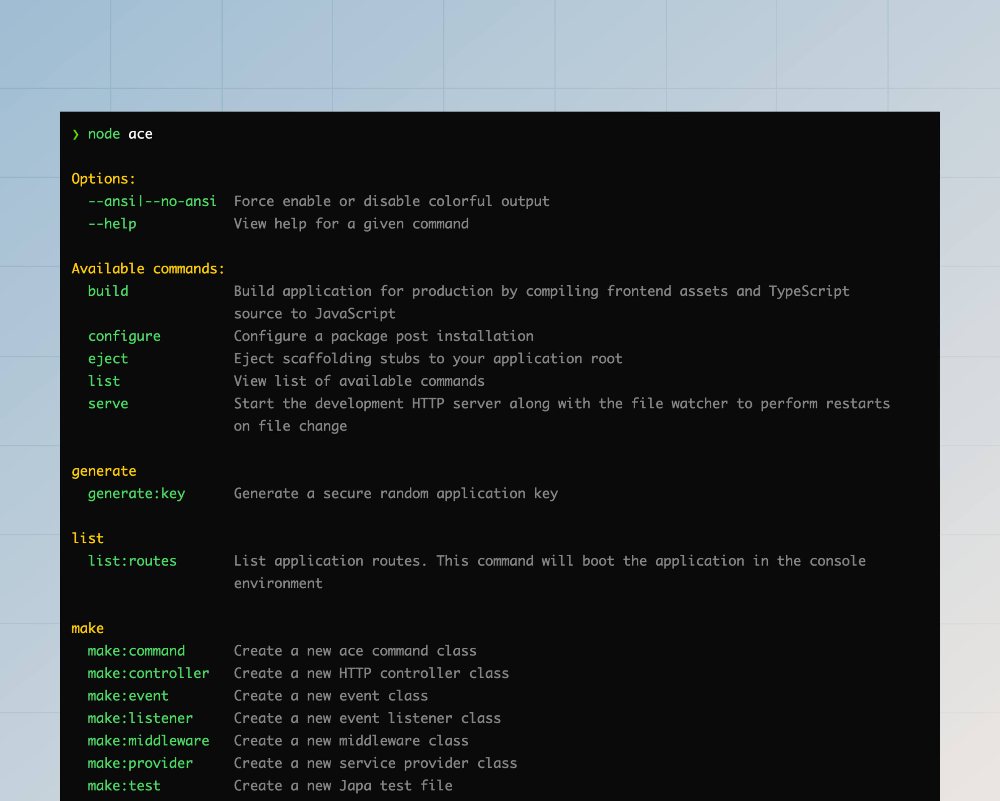
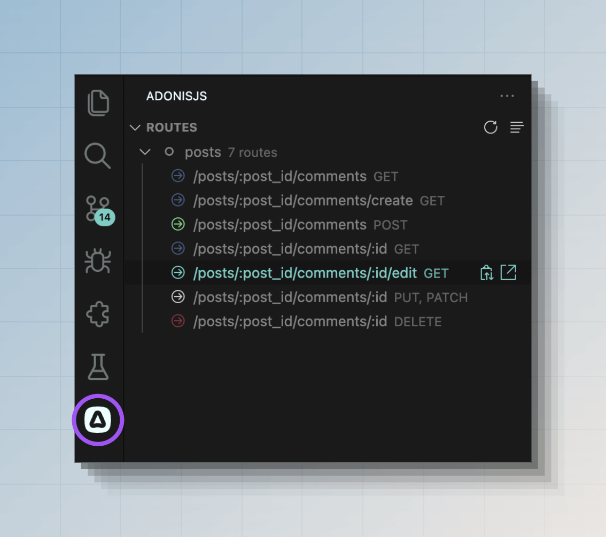

# Commands reference

In this guide, we cover the usage of all the commands shipped with the framework core and the official packages. You may also view the commands help using the `node ace list` command or the `node ace <command-name> --help` command.

```sh
node ace list
```



:::note

The output of the help screen is formatted as per the [docopt](http://docopt.org/) standard.

:::

## serve
The `serve` uses the [@adonisjs/assembler](https://github.com/adonisjs/assembler?tab=readme-ov-file#dev-server) package to start the AdonisJS application in development environment. You can optionally watch for file changes and restart the HTTP server on every file change.

```sh
node ace serve --hmr
```

The `serve` command starts the development server (via the `bin/server.ts` file) as a child process. If you want to pass [node arguments](https://nodejs.org/api/cli.html#options) to the child process, you can define them before the command name.

```sh
node ace --no-warnings --inspect serve --hmr
```

Following is the list of available options you can pass to the `serve` command. Alternatively, use the `--help` flag to view the command's help.

<dl>

<dt>

--hmr

</dt>

<dd>

Watch the filesystem and reload the server in HMR mode.

</dd>

<dt>

--watch

</dt>

<dd>

Watch the filesystem and always restart the process on file change.

</dd>

<dt>

--poll

</dt>

<dd>

Use polling to detect filesystem changes. You might want to use polling when using a Docker container for development.

</dd>

<dt>

--clear | --no-clear

</dt>

<dd>

Clear the terminal after every file change and before displaying the new logs. Use the `--no-clear` flag to retain old logs.

</dd>

<dt>

--assets | --no-assets

</dt>

<dd>

Start the assets bundle development server alongside the AdonisJS HTTP server. Use the `--no-assets` flag to turn off the assets bundler dev server.

</dd>

<dt>

--assets-args

</dt>

<dd>

Pass commandline arguments to the asset manager child process. For example, if you use vite, you can define its options as follows.

```sh
node ace serve --hmr --assets-args="--cors --open"
```

</dd>

</dl>

## build
The `build` command uses the [@adonisjs/assembler](https://github.com/adonisjs/assembler?tab=readme-ov-file#bundler) package to create the production build of your AdonisJS application. The following steps are performed to generate the build.

See also: [TypeScript build process](../concepts/typescript_build_process.md).

```sh
node ace build
```

Following is the list of available options you can pass to the `build` command. Alternatively, use the `--help` flag to view the command's help.

<dl>

<dt>

--ignore-ts-errors

</dt>

<dd>

The build command terminates the build process when your project has TypeScript errors. However, you can ignore those errors and finish the build using the `--ignore-ts-errors` flag.

</dd>

<dt>

--package-manager

</dt>

<dd>

The build command copies the `package.json` file alongside the lock file of the package manager your application is using. 

We detect the package manager using the [@antfu/install-pkg](https://github.com/antfu/install-pkg) package. However, you can turn off detection by explicitly providing the package manager's name.

</dd>

<dt>

--assets | --no-assets

</dt>

<dd>

Bundle frontend assets alongside your backend application. Use the `--no-assets` flag to turn off the assets bundler dev server.

</dd>

<dt>

--assets-args

</dt>

<dd>

Pass commandline arguments to the asset manager child process. For example, if you use vite, you can define its options as follows.

```sh
node ace build --assets-args="--sourcemap --debug"
```

</dd>

</dl>

## add

The `add` command combines the `npm install <package-name>` and `node ace configure` commands. So, instead of running two separate commands, you can install and configure the package in one go using the `add` command.

The `add` command will automatically detect the package manager used by your application and use that to install the package. However, you can always opt for a specific package manager using the `--package-manager` CLI flag.

```sh
# Install and configure the @adonisjs/lucid package
node ace add @adonisjs/lucid

# Install the package as a development dependency and configure it
node ace add my-dev-package --dev
```

If the package can be configured using flags, you can pass them directly to the `add` command. Every unknown flag will be passed down to the `configure` command.

```sh
node ace add @adonisjs/lucid --db=sqlite
```

<dl>

<dt>

--verbose

</dt>

<dd>

Enable verbose mode to display the package installation and configuration logs.

</dd>

<dt>

--force

</dt>

<dd>

Passed down to the `configure` command. Force overwrite files when configuring the package. See the `configure` command for more information.

<dt>

--package-manager

</dt>

<dd>

Define the package manager to use for installing the package. The value must be `npm`, `pnpm`, `bun` or `yarn`.

</dd>

<dt>

--dev

</dt>

<dd>

Install the package as a development dependency.

</dd>

</dl>

## configure
Configure a package after it has been installed. The command accepts the package name as the first argument.

```sh
node ace configure @adonisjs/lucid
```

<dl>

<dt>

--verbose

</dt>

<dd>

Enable verbose mode to display the package installation logs.

</dd>

<dt>

--force

</dt>

<dd>

The stubs system of AdonisJS does not overwrite existing files. For example, if you configure the `@adonisjs/lucid` package and your application already has a `config/database.ts` file, the configure process will not overwrite the existing config file.

However, you can force overwrite files using the `--force` flag.

</dd>

</dl>

## eject

Eject stubs from a given package to your application `stubs` directory. In the following example, we copy the `make/controller` stubs to our application for modification.

See also: [Customizing stubs](../concepts/scaffolding.md#ejecting-stubs)

```sh
# Copy stub from @adonisjs/core package
node ace eject make/controller

# Copy stub from @adonisjs/bouncer package
node ace eject make/policy --pkg=@adonisjs/bouncer
```

## generate\:key
Generate a cryptographically secure random key and write to the `.env` file as the `APP_KEY` environment variable.

See also: [App key](../security/encryption.md)

```sh
node ace generate:key
```

<dl>

<dt>

--show

</dt>

<dd>

Display the key on the terminal instead of writing it to the `.env` file. By default, the key is written to the env file.

</dd>

<dt>

--force

</dt>

<dd>

The `generate:key` command does not write the key to the `.env` file when running your application in production. However, you can use the `--force` flag to override this behavior.

</dd>

</dl>

## make\:controller

Create a new HTTP controller class. Controllers are created inside the `app/controllers` directory and use the following naming conventions.

- Form: `plural`
- Suffix: `controller`
- Class name example: `UsersController`
- File name example: `users_controller.ts`

```sh
node ace make:controller users
```

You also generate a controller with custom action names, as shown in the following example.

```sh
# Generates controller with "index", "show", and "store" methods
node ace make:controller users index show store
```

<dl>

<dt>

--singular

</dt>

<dd>

Force the controller name to be in singular form.

</dd>

<dt>

--resource

</dt>

<dd>

Generate a controller with methods to perform CRUD operations on a resource.

</dd>

<dt>

--api

</dt>

<dd>

The `--api` flag is similar to the `--resource` flag. However, it does not define the `create` and the `edit` methods since they are used to display forms.

</dd>

</dl>

## make\:middleware
Create a new middleware for HTTP requests. Middleware are stored inside the `app/middleware` directory and uses the following naming conventions.

- Form: `singular`
- Suffix: `middleware`
- Class name example: `BodyParserMiddleware`
- File name example: `body_parser_middleware.ts`

```sh
node ace make:middleware bodyparser
```

<dl>

<dt>

--stack

</dt>

<dd>

Skip the [middleware stack](../basics/middleware.md#middleware-stacks) selection prompt by defining the stack explicitly. The value must be `server`, `named`, or `router`.

```sh
node ace make:middleware bodyparser --stack=router
```

</dd>

</dl>

## make\:event
Create a new event class. Events are stored inside the `app/events` directory and use the following naming conventions.

- Form: `NA`
- Suffix: `NA`
- Class name example: `OrderShipped`
- File name example: `order_shipped.ts`
- Recommendation: You must name your events around the lifecycle of an action. For example: `MailSending`, `MailSent`, `RequestCompleted`, and so on.

```sh
node ace make:event orderShipped
```

## make\:validator
Create a new VineJS validator file. The validators are stored inside the `app/validators` directory, and each file may export multiple validators.

- Form: `singular`
- Suffix: `NA`
- File name example: `user.ts`
- Recommendation: You must create validator files around the resources of your application.

```sh
# A validator for managing a user
node ace make:validator user

# A validator for managing a post
node ace make:validator post
```

<dl>

<dt>

--resource

</dt>

<dd>

Create a validator file with pre-defined validators for `create` and `update` actions.

```sh
node ace make:validator post --resource
```

</dd>

</dl>

## make\:listener

Create a new event listener class. The listener classes are stored inside the `app/listeners` directory and use the following naming conventions.

- Form: `NA`
- Suffix: `NA`
- Class name example: `SendShipmentNotification`
- File name example: `send_shipment_notification.ts`
- Recommendation: The event listeners must be named after the action they perform. For example, a listener that sends the shipment notification email should be called `SendShipmentNotification`.

```sh
node ace make:listener sendShipmentNotification
```

<dl>

<dt>

--event

</dt>

<dd>

Generate an event class alongside the event listener.

```sh
node ace make:listener sendShipmentNotification --event=shipment_received
```

</dd>

</dl>

## make\:service

Create a new service class. Service classes are stored inside the `app/services` directory and use the following naming conventions.

:::note

A service has no pre-defined meaning, and you can use it to extract the business logic inside your application. For example, if your application generates a lot of PDFs, you may create a service called `PdfGeneratorService` and reuse it in multiple places.

:::

- Form: `singular`
- Suffix: `service`
- Class name example: `InvoiceService`
- File name example: `invoice_service.ts`

```sh
node ace make:service invoice
```

## make\:exception

Create a new [custom exception class](../basics/exception_handling.md#custom-exceptions). Exceptions are stored inside the `app/exceptions` directory.

- Form: `NA`
- Suffix: `exception`
- Class name example: `CommandValidationException`
- File name example: `command_validation_exception.ts`

```sh
node ace make:exception commandValidation
```

## make\:command

Create a new Ace command. By default, the commands are stored inside the `commands` directory at the root of your application.

Commands from this directory are imported automatically by AdonisJS when you try to execute any Ace command. You may prefix the filename with an `_` to store additional files that are not Ace commands in this directory.

- Form: `NA`
- Suffix: `NA`
- Class name example: `ListRoutes`
- File name example: `list_routes.ts`
- Recommendation: Commands must be named after the action they perform. For example, `ListRoutes`, `MakeController`, and `Build`.

```sh
node ace make:command listRoutes
```

## make\:view
Create a new Edge.js template file. The templates are created inside the `resources/views` directory.

- Form: `NA`
- Suffix: `NA`
- File name example: `posts/view.edge`
- Recommendation: You must group templates for a resource inside a subdirectory. For example: `posts/list.edge`, `posts/create.edge`, and so on.

```sh
node ace make:view posts/create
node ace make:view posts/list
```

## make\:provider

Create a [service provider file](../concepts/service_providers.md). Providers are stored inside the `providers` directory at the root of your application and use the following naming conventions.

- Form: `singular`
- Suffix: `provider`
- Class name example: `AppProvider`
- File name example: `app_provider.ts`

```sh
node ace make:provider app
```


<dl>

<dt>

--environments

</dt>

<dd>

Define environments in which the provider should get imported. [Learn more about app environments](../concepts/application.md#environment)

```sh
node ace make:provider app -e=web -e=console
```

</dd>

</dl>

## make\:preload

Create a new [preload file](../concepts/adonisrc_file.md#preloads). Preload files are stored inside the `start` directory.

```sh
node ace make:preload view
```

<dl>

<dt>

--environments

</dt>

<dd>

Define environments in which the preload file should get imported. [Learn more about app environments](../concepts/application.md#environment)

```sh
node ace make:preload view app -e=web -e=console
```

</dd>

</dl>

## make\:test
Create a new test file inside the `tests/<suite>` directory.

- Form: NA
- Suffix: `.spec`
- File name example: `posts/list.spec.ts`, `posts/update.spec.ts`

```sh
node ace make:test --suite=unit
```

<dl>

<dt>

--suite

</dt>

<dd>

Define the suite for which you want to create the test file. Otherwise, the command will display a prompt for suite selection.

</dd>

</dl>

## make\:mail

Create a new mail class inside the `app/mails` directory. The mail classes are suffixed with the `Notification` keyword. However, you may define a custom suffix using the `--intent` CLI flag.

- Form: NA
- Suffix: `Intent`
- Class name example: ShipmentNotification
- File name example: shipment_notification.ts

```sh
node ace make:mail shipment
# ./app/mails/shipment_notification.ts
```


<dl>

<dt>

--intent

</dt>

<dd>

Define a custom intent for the mail.

```sh
node ace make:mail shipment --intent=confirmation
# ./app/mails/shipment_confirmation.ts

node ace make:mail storage --intent=warning
# ./app/mails/storage_warning.ts
```

</dd>

</dl>

## make\:policy

Create a new Bouncer policy class. The policies are stored inside the `app/policies` folder and use the following naming conventions.

- Form: `singular`
- Suffix: `policy`
- Class name example: `PostPolicy`
- File name example: `post_policy.ts`

```sh
node ace make:policy post
```

## inspect\:rcfile
View the contents of the `adonisrc.ts` file after merging the defaults. You may use this command to inspect the available configuration options and override them per your application requirements.

See also: [AdonisRC file](../concepts/adonisrc_file.md)

```sh
node ace inspect:rcfile
```

## list\:routes
View list of routes registered by your application. This command will boot your AdonisJS application in the `console` environment.

```sh
node ace list:routes
```

Also, you can see the routes list from the VSCode activity bar if you are using our [official VSCode extension](https://marketplace.visualstudio.com/items?itemName=jripouteau.adonis-vscode-extension).



<dl>

<dt>

--json

</dt>

<dd>

View routes as a JSON string. The output will be an array of object.

</dd>

<dt>

--table

</dt>

<dd>

View routes inside a CLI table. By default, we display routes inside a compact, pretty list.

</dd>

<dt>

--middleware

</dt>

<dd>

Filter routes list and include the ones using the mentioned middleware. You may use the `*` keyword to include routes using one or more middleware.

</dd>

<dt>

--ignore-middleware

</dt>

<dd>

Filter routes list and include the ones NOT using the mentioned middleware. You may use the `*` keyword to include routes that do not use any middleware.

</dd>

</dl>

## env\:add

The `env:add` command allows you to add a new environment variables to the `.env`, `.env.example` files and will also define the validation rules in the `start/env.ts` file. 

You can just run the command and it will prompt you for the variable name, value, and validation rules. Or you can pass them as arguments.

```sh
# Will prompt for the variable name, value, and validation rules
node ace env:add

# Define the variable name, value, and validation rule
node ace env:add MY_VARIABLE value --type=string
```

<dl>

<dt>

--type

</dt>

<dd>

Define the type of the environment variable. The value must be one of the following: `string`, `boolean`, `number`, `enum`.

</dd>

<dt>

--enum-values

</dt>

<dd>

Define the allowed values for the environment variable when the type is `enum`. 

```sh
node ace env:add MY_VARIABLE foo --type=enum --enum-values=foo --enum-values=bar
```

</dd>

</dl>
