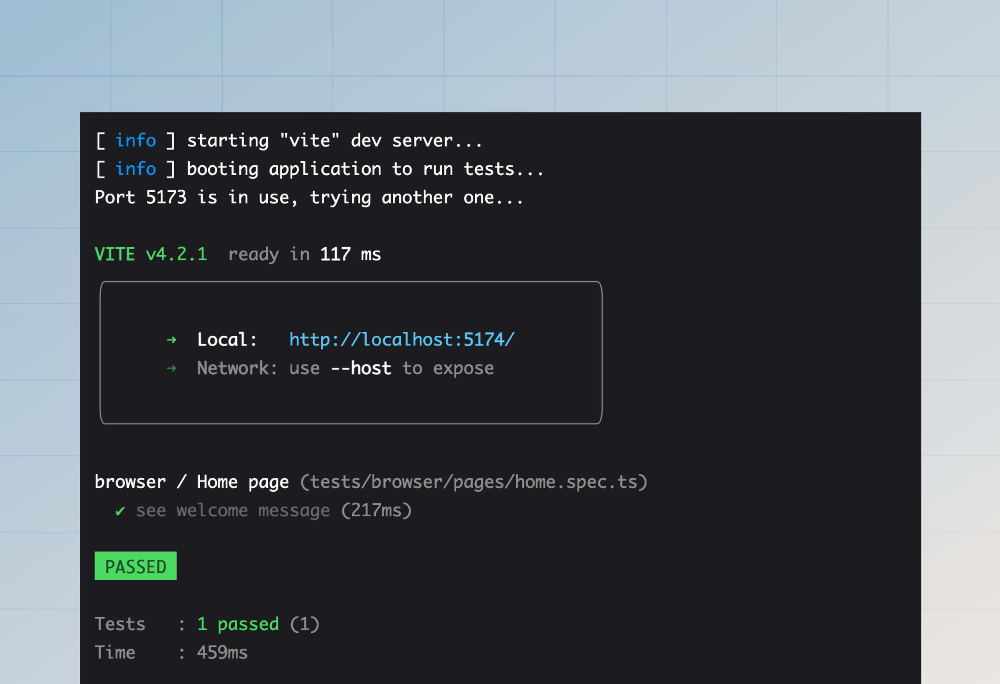

# Testes de navegador

Os testes de navegador são executados dentro de navegadores reais como Chrome, Firefox ou Safari. Usamos o [Playwright](https://playwright.dev/) (uma ferramenta de automação de navegador) para interagir com páginas da web programaticamente.

O Playwright é uma estrutura de teste e uma biblioteca que expõe APIs JavaScript para interagir com o navegador. **Não usamos a estrutura de teste do Playwright** porque já estamos usando o Japa, e usar várias estruturas de teste dentro de um único projeto só levará à confusão e ao inchaço da configuração.

Em vez disso, usaremos o plug-in [Cliente do navegador](https://japa.dev/docs/plugins/browser-client) do Japa, que se integra bem com o Playwright e oferece uma ótima experiência de teste.

## Configuração
O primeiro passo é instalar os seguintes pacotes do registro de pacotes npm.

:::codegroup

```sh
// title: npm
npm i -D playwright @japa/browser-client
```

:::

### Registrando o conjunto de navegadores
Vamos começar criando um novo conjunto de testes para testes de navegadores dentro do arquivo `adonisrc.ts`. Os arquivos de teste para o conjunto de navegadores serão armazenados dentro do diretório `tests/browser`.

```ts
{
  tests: {
    suites: [
      // highlight-start
      {
        files: [
          'tests/browser/**/*.spec(.ts|.js)'
        ],
        name: 'browser',
        timeout: 300000
      }
      // highlight-end
    ]
  }
}
```

### Configurando o plugin
Antes de começar a escrever testes, você deve registrar o plugin `browserClient` dentro do arquivo `tests/bootstrap.ts`.

```ts
import { browserClient } from '@japa/browser-client'

export const plugins: Config['plugins'] = [
  assert(),
  apiClient(),
  // highlight-start
  browserClient({
    runInSuites: ['browser']
  }),
  // highlight-end
  pluginAdonisJS(app)
]
```

## Exemplo básico
Vamos criar um teste de exemplo que abrirá a página inicial do seu aplicativo AdonisJS e verificará o conteúdo da página. O auxiliar [`visit`](https://japa.dev/docs/plugins/browser-client#browser-api) abre uma nova página e visita uma URL. O valor de retorno é o [objeto de página](https://playwright.dev/docs/api/class-page).

Veja também: [Lista de métodos de asserções](https://japa.dev/docs/plugins/browser-client#assertions)

```sh
node ace make:test pages/home --suite=browser
# DONE:    create tests/browser/pages/home.spec.ts
```

```ts
// title: tests/browser/pages/home.spec.ts
import { test } from '@japa/runner'

test.group('Home page', () => {
  test('see welcome message', async ({ visit }) => {
    const page = await visit('/')
    await page.assertTextContains('body', 'It works!')
  })
})
```

Por fim, vamos executar o teste acima usando o comando `test`. Você pode usar o sinalizador `--watch` para criar um observador de arquivo e executar novamente os testes em cada alteração de arquivo.

```sh
node ace test browser
```



## Leitura/gravação de cookies
Ao testar dentro de um navegador real, os cookies são persistidos durante todo o ciclo de vida de um [contexto do navegador](https://playwright.dev/docs/api/class-browsercontext).

O Japa cria um novo contexto do navegador para cada teste. Portanto, os cookies de um teste não vazarão para outros testes. No entanto, várias visitas de página dentro de um único teste compartilharão os cookies porque usam o mesmo `browserContext`.

```ts
test.group('Home page', () => {
  test('see welcome message', async ({ visit, browserContext }) => {
    // highlight-start
    await browserContext.setCookie('username', 'virk')
    // highlight-end
    
    // The "username" cookie will be sent during the request
    const homePage = await visit('/')

    // The "username" cookie will also be sent during this request
    const aboutPage = await visit('/about')
  })
})
```

Da mesma forma, os cookies definidos pelo servidor podem ser acessados ​​usando o método `browserContext.getCookie`.

```ts
import router from '@adonisjs/core/services/router'

router.get('/', async ({ response }) => {
  // highlight-start
  response.cookie('cartTotal', '100')
  // highlight-end

  return 'It works!'
})
```

```ts
test.group('Home page', () => {
  test('see welcome message', async ({ visit, browserContext }) => {
    const page = await visit('/')
    // highlight-start
    console.log(await browserContext.getCookie('cartTotal'))
    // highlight-end
  })
})
```

Você pode usar os seguintes métodos para ler/gravar cookies criptografados e simples.

```ts
// Write
await browserContext.setEncryptedCookie('username', 'virk')
await browserContext.setPlainCookie('username', 'virk')

// Read
await browserContext.getEncryptedCookie('cartTotal')
await browserContext.getPlainCookie('cartTotal')
```

## Preenchendo o armazenamento de sessão
Se você estiver usando o pacote [`@adonisjs/session`](../basics/session.md) para ler/escrever dados de sessão em seu aplicativo, você também pode querer usar o plugin `sessionBrowserClient` para preencher o armazenamento de sessão ao escrever testes.

### Configuração
O primeiro passo é registrar o plugin dentro do arquivo `tests/bootstrap.ts`.

```ts
// insert-start
import { sessionBrowserClient } from '@adonisjs/session/plugins/browser_client'
// insert-end

export const plugins: Config['plugins'] = [
  assert(),
  pluginAdonisJS(app),
  // insert-start
  sessionBrowserClient(app)
  // insert-end
]
```

E então, atualize o arquivo `.env.test` (crie um se estiver faltando) e defina o `SESSON_DRIVER` para `memory`.

```dotenv
// title: .env.test
SESSION_DRIVER=memory
```

### Escrevendo dados de sessão
Você pode usar o método `browserContext.setSession` para definir os dados de sessão para o contexto atual do navegador.

Todas as visitas de página usando o mesmo contexto do navegador terão acesso aos mesmos dados da sessão. No entanto, os dados da sessão serão removidos quando o navegador ou o contexto for fechado.

```ts
test('checkout with cart items', async ({ browserContext, visit }) => {
  // highlight-start
  await browserContext.setSession({
    cartItems: [
      {
        id: 1,
        name: 'South Indian Filter Press Coffee'
      },
      {
        id: 2,
        name: 'Cold Brew Bags',
      }
    ]
  })
  // highlight-end

  const page = await visit('/checkout')
})
```

Assim como o método `setSession`, você pode usar o método `browser.setFlashMessages` para definir mensagens flash.

```ts
/**
 * Define flash messages
 */
await browserContext.setFlashMessages({
  success: 'Post created successfully',
})

const page = await visit('/posts/1')

/**
 * Assert the post page shows the flash message
 * inside ".alert-success" div.
 */
await page.assertExists(page.locator(
  'div.alert-success',
  { hasText: 'Post created successfully' }
))
```

### Lendo dados da sessão
Você pode ler os dados dentro de um armazenamento de sessão usando os métodos `browserContext.getSession` e `browser.getFlashMessages`. Esses métodos retornarão todos os dados para o ID da sessão associado a uma instância específica do contexto do navegador.

```ts
const session = await browserContext.getSession()
const flashMessages = await browserContext.getFlashMessages()
```

## Autenticando usuários
Se você estiver usando o pacote `@adonisjs/auth` para autenticar usuários em seu aplicativo, você pode usar o plugin `authBrowserClient` Japa para autenticar usuários ao fazer solicitações HTTP para seu aplicativo.

O primeiro passo é registrar o plugin dentro do arquivo `tests/bootstrap.ts`.

```ts
// title: tests/bootstrap.ts
// insert-start
import { authBrowserClient } from '@adonisjs/auth/plugins/browser_client'
// insert-end

export const plugins: Config['plugins'] = [
  assert(),
  pluginAdonisJS(app),
  // insert-start
  authBrowserClient(app)
  // insert-end
]
```

Se você estiver usando autenticação baseada em sessão, certifique-se de também configurar o plugin de sessão. Veja [Preenchendo o armazenamento de sessão - Configuração](#setup-1).

Isso é tudo. Agora, você pode fazer login de usuários usando o método `loginAs`. O método aceita o objeto do usuário como o único argumento e marca o usuário como conectado no contexto atual do navegador.

Todas as visitas de página usando o mesmo contexto do navegador terão acesso ao usuário conectado. No entanto, a sessão do usuário será destruída quando o navegador ou o contexto for fechado.

```ts
import User from '#models/user'

test('get payments list', async ({ browserContext, visit }) => {
  // highlight-start
  const user = await User.create(payload)
  await browserContext.loginAs(user)
  // highlight-end

  const page = await visit('/dashboard')
})
```

O método `loginAs` usa o guard padrão configurado dentro do arquivo `config/auth.ts` para autenticação. No entanto, você pode especificar um guard personalizado usando o método `withGuard`. Por exemplo:

```ts
const user = await User.create(payload)
await browserContext
  .withGuard('admin')
  .loginAs(user)
```

## O auxiliar de rota
Você pode usar o auxiliar `route` do TestContext para criar uma URL para uma rota. Usar o auxiliar de rota garante que sempre que você atualizar suas rotas, não precise voltar e corrigir todas as URLs dentro de seus testes.

O auxiliar `route` aceita o mesmo conjunto de argumentos aceitos pelo método de modelo global [route](../basics/routing.md#url-builder).

```ts
test('see list of users', async ({ visit, route }) => {
  const page = await visit(
    // highlight-start
    route('users.list')
    // highlight-end
  )
})
```
